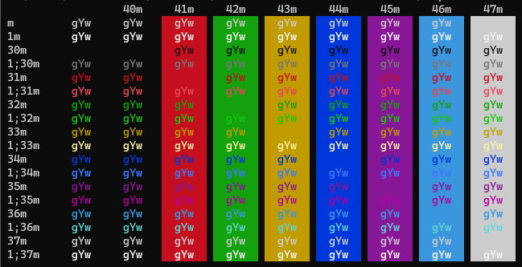

Windows Terminal
================
Colorful for text output :footcite:p:`schulz23_terminal_colors`
---------------------------------------------------------------
`ANSI-Escape-Sequences`_ can be used to tell the Windows Terminal to print text
in various colors. It is possible to define a text color and a background color.
The *Windows Terminal* application supports the 8-Bit colors, although standard
and bright colors are sometimes not differentiable (e.g. green foreground).

.. hint::

    The Windows Console uses an old protocol named VT100 which invented in the
    late 70s, featuring control commands. Those were mostly used to tell the
    displaying terminal what to do, like cleaning the screen or position the
    cursor. Later, colors were supported, though only a limited set. The
    commands remain unchanged until today.

The valid sequences are:

+-------------------+-------------+-------------+
| Color             | Foreground  | Background  |
+===================+=============+=============+
| Black             | ESC[30m     | ESC[40m     |
+-------------------+-------------+-------------+
| Red               | ESC[31m     | ESC[41m     |
+-------------------+-------------+-------------+
| Green             | ESC[32m     | ESC[42m     |
+-------------------+-------------+-------------+
| Yellow            | ESC[33m     | ESC[43m     |
+-------------------+-------------+-------------+
| Blue              | ESC[34m     | ESC[44m     |
+-------------------+-------------+-------------+
| Violet            | ESC[35m     | ESC[45m     |
+-------------------+-------------+-------------+
| Turquoise         | ESC[36m     | ESC[46m     |
+-------------------+-------------+-------------+
| Bright Grey       | ESC[37m     | ESC[47m     |
+-------------------+-------------+-------------+
| Dark Grey         | ESC[90m     | ESC[100m    |
+-------------------+-------------+-------------+
| Bright Red        | ESC[91m     | ESC[101m    |
+-------------------+-------------+-------------+
| Bright Green      | ESC[92m     | ESC[102m    |
+-------------------+-------------+-------------+
| Bright Yellow     | ESC[93m     | ESC[103m    |
+-------------------+-------------+-------------+
| Bright Blue       | ESC[94m     | ESC[104m    |
+-------------------+-------------+-------------+
| Bright Violet     | ESC[95m     | ESC[105m    |
+-------------------+-------------+-------------+
| Bright Turquoise  | ESC[96m     | ESC[106m    |
+-------------------+-------------+-------------+
| White             | ESC[97m     | ESC[107m    |
+-------------------+-------------+-------------+
| RESET             | ESC[39m     | ESC[49m     |
+-------------------+-------------+-------------+

Here **ESC** stands for the special character Escape (ASCII-Code 27, 0x1b).

Most terminals support various color schemes, which map an color code to a specific
color defined in RGB values. The `ColorTool`_ from Windows Terminal, for instance,
displays the default *Campbell* scheme like this:

The bright colors start with **1;** (for example, 1;32m for bright green) which
is another valid way to write the escape codes.

.. important::

    Some terminals do not differentiate between standard and bright colors or
    use different colors schemes. So expect different results when using another
    Terminal. In *Windows Terminal*, the scheme can be defined in
    :menuselection:`Settings --> Color Schemes`. Additional themes can be
    downloaded from https://terminalsplash.com/ and copied into the config JSON
    via :menuselection:`Settings --> Open JSON file` (lower left corner).

#. These sequences start with the unprintable *Escape* character. To enter it,
   create it by opening a PowerShell window and type

    .. prompt:: powershell

        Set-Clipboard ([char]27)

    which puts the character into the clipboard for further usage (The escape
    character has the ANSI-Code 27).
#. Open the script, which is supposed to print colored text. Optionally, define
   the *Escape* character as variable. Here for batch:

    .. code:: batch

        set ESC=

    where the square is the pasted Escape character (might be displayed differently,
    depending on the used editor)
#. Stating an ANSI-Escape-Sequence for color changes the color from that
   character **onwards**. So to properly colorize a certain section of a
   printed text

    * its beginning must set the formatting to the desired color
    * at its end, the formatting must be set back to default

    Example:

    .. code-block:: batch

        set ESC=
        echo standard text - %ESC%[40mred text%ESC%[39m

    which renders to:

        standard text - :rfg:`red text`

    ``%ESC%[40m`` defines a red text, whereas ``%ESC%[39m`` sets it back to
    default.

#. To define both a foreground and a background color, they can be put together
   in one expression:

    .. code-block:: batch

        set ESC=
        echo %ESC%[35;101mViolet text on bright red background%ESC%[39;49m

   Here, foreground **and** background must be reset afterwards.

.. _ANSI-Escape-Sequences: https://en.wikipedia.org/wiki/ANSI_escape_code#Colors
.. _ColorTool: https://github.com/microsoft/terminal/releases/tag/1904.29002

.. footbibliography::