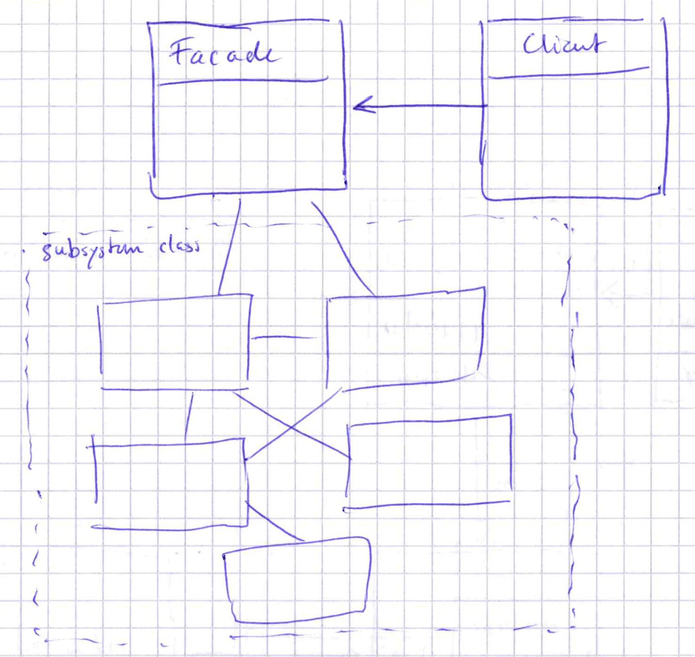

Facade Pattern
--------------
Issue
`````

* Following the `Single Responsibility Principle`_, that each class is only supposed to be responsible
  for one particular thing is likely to lead to lots of classes
* As a consequence, a lot of classes needs to be used in order to do something meaningful inside an
  application

.. _Single Responsibility Principle: https://en.wikipedia.org/wiki/Single-responsibility_principle

Solution
````````

* Complex wiring of classes is OK, but created a facade enables to cover up all internal complexities
* A *Facade* class covers all this complexity inside a single method
* A *Client* then can access those *Facade* methods without having to access the subsystem classes
  -> coupling is reduced to a minimum

.. admonition:: Design Principle 1
    :class: design_principle

    **Principle of Least Knowledge: talk only to your immediate friends**

    It promotes to reduce the amount of classes one class interacts with. Every interaction
    of one class (Class A) with another class (Class B) potentially requires an adaptation
    of the Class A in case Class B changes. It's costly to maintain, but also harder for others
    to understand.

.. admonition:: Definition
    :class: pattern_definition

    The **Facade Pattern** provides a unified interface to a set of interfaces in a subsystem.
    Facade defines a higher-level interface that makes the subsystem easier to use.



Find a template example for Python at https://refactoring.guru/design-patterns/facade/python/example.
