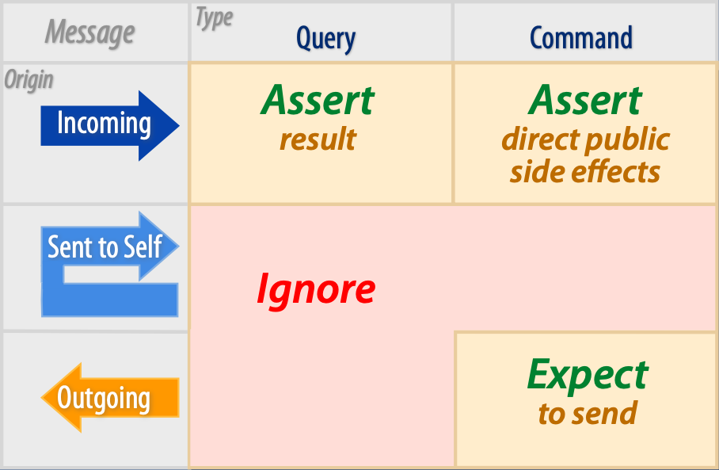

Magic Tricks on Testing (Sandy Metz)
------------------------------------
Based on https://youtu.be/URSWYvyc42M.

The talk gives a clear recommendation on which methods of an object are subject to
unit tests, and which should be omitted.

An object, the *Object under Test* (OUT), is a regular class, containing methods (functions
within objects are called methods).

The ruleset implies that a message (a.k.a method call) is either of type **command**
or **query**, but never both.

.. hint::

    There is a principle for separating commands and queries, called the
    `Command–query separation (CQS) <https://en.wikipedia.org/wiki/Command%E2%80%93query_separation>`_
    principle. It is generally not always advisable to strictly follow this rule, though.

A query is a call on a method which

    * returns data to the caller
    * does not alter the state of any object (no side-effects)

A command is a call on a method which

    * returns no data
    * alters the state of one or many objects (side-effects)

Furthermore, there are three origin types for messages, which define from where
a method is called from the perspective of the OUT:

    * methods, which are called by an outside object -> **Incoming**
    * methods, which call methods from outside objects -> **Outgoing**
    * methods, which call internal (private) methods -> **Send-to-Self**

In total then, there are six types of methods:

.. figure:: _img/unit_test_minimalist_blank.png

    Type of messages types

Example module
``````````````
This module feature three object, ``Wheel``, ``Gear`` and ``Observer``.

.. literalinclude:: _code/magic_tricks_OUT.py
    :language: python

**Incoming Query**

.. admonition:: Rule
    :class: design_principle

    |:white_check_mark:| Test incoming query messages by making assertions about what they send back.

Incoming queries should always be tested, as it is our object, and we are responsible for its
methods to return the correct value. So, we write one or multiple tests for it, asserting towards
the returned value.

The ``diameter(self)`` method in ``Wheel`` is a subject to incoming queries, so we write a
test for it, asserting to the return value:

.. code-block:: python

    class WheelTest(unittest.TestCase):

    # GOOD: Test incoming query
    def test_calculates_diameter(self):
        wheel = Wheel(26, 1.5)
        # assert the return value
        assert math.isclose(wheel.diameter(), 29, rel_tol=0.02)

The same applies to the ``gear_inches(self)`` method in ``Gear``, so we write another test:

.. code-block:: python

    class GearTest(unittest.TestCase):

    # GOOD: Test incoming query
    def test_calculates_gear_inches(self):
        gear = Gear(52, 11, Wheel(26, 1.5))
        # assert the return value
        assert math.isclose(gear.gear_inches(), 137.1, rel_tol=0.01)

**Incoming Commands**

.. admonition:: Rule
    :class: design_principle

    |:white_check_mark:| Test incoming command messages by making assertions about direct public side effects.

Incoming commands should always be tested, as it is our object, and we are responsible
for the direct public side-effects our methods have. So, we write one or multiple tests for it,
asserting towards these side-effects.

The ``set_cog(self)`` method of the ``Gear`` class is a subject to incoming commands, as
it changes the objects state (side-effect), but does not return a value. Consequentially,
we write a unit test for it:

.. code-block:: python

    class GearTest(unittest.TestCase):

    # ...

    # GOOD: Test incoming command
    def test_set_cog(self):
        gear = Gear(52, 11, Wheel(26, 1.5))
        gear.set_cog(27)
        # assert the direct public side effect
        assert 27 == gear.cog

**Messages To Self (Query/Command)**

.. admonition:: Rule
    :class: design_principle

    |:x:| Do not test private methods.

Testing internal queries (assert return values) or commands (assert if certain set-method
was called or value was changed) explicitly is redundant since these methods are
already covered by other tests. Therefore, defining such tests do not improve the
security of your code, but fail, if the code is improved, since it is bound to it.

The ``_ratio(self)`` method of class ``Gear`` is a **Send-to-Self query**, since it is
a private method (Python marks private method with a preceding underscore). A test is
redundant, since the method is already covered by the ``test_calculates_gear_inches(self)``
method, since ``gear_inches(self)`` is calling ``_ratio(self)``. No additional test is
necessary.

This test is redundant:

.. code-block:: python

        class GearTest(unittest.TestCase):

        # ...

        # BAD: redundant test
        def test_calculates_ratio(self):
        gear = Gear(52, 11, Wheel(26, 1.5))
        assert math.isclose(gear._ratio(), 4.7, rel_tol=0.01)

Additionally, if the internal implementation of ``_ratio(self)`` changes (or its name),
this test breaks, so there is a maintenance effort for a test of no value.

**Outgoing Query**

.. admonition:: Rule
    :class: design_principle

    |:x:| Do not test outgoing query messages.

An outgoing query of one object is always an incoming query of another object.
Therefore asserting the return value of an outgoing query is already covered
by the tests of that other object.

Don't write tests for it, since they are redundant:

.. code-block:: python

        class GearTest(unittest.TestCase):

        # ...

        # BAD: test outgoing queries -> redundant test
        def test_calculate_gear_inches_outgoing(self):
        gear = Gear(52, 11, Wheel(26, 1.5))
        diameter = gear.wheel.diameter()
        assert math.isclose(diameter, 29, rel_tol=0.01)

**Outgoing Commands**

.. admonition:: Rule
    :class: design_principle

    |:white_check_mark:| Expect to send outgoing command messages
    (assert on method calls of outside object).

A unit test is supposed to test the object under test, not the effects it has on
other distant objects -> this is then an integration test. The only thing to test is
that outgoing command messages are sent, on other words, that these OUT methods have
been called.

Testing an outgoing command against a real interface, which relies on a chain of
events is not a good idea, since it easily breaks for reasons out of the unit tests scope.

.. code-block:: python

    class GearTest(unittest.TestCase):

        # ...

        # BAD: test against real interface (here: set_cog(27) calls an Observer instance)
        def test_saves_changed_cog_in_db(self):
            gear = Gear(chainring=52, cog=11, wheel=Wheel(26, 1.5),
                        observer=Observer())
            gear.set_cog(27)

Therefore instead of calling the real interface, use a **mock** object, which the internal outgoing
command method calls instead, to have a stable edge. Remember: A mock is a test
double which promises to have the same API as the real object (must stay in-sync).

.. code-block:: python

    from unittest import mock

    class GearTest(unittest.TestCase):

        # GOOD: test against a mock, instead of a real out-of-scope interface
        def test_notifies_observers_when_cogs_changes(self):

            with mock.patch("unittest_magic_tricks.Observer") as MockObserver:
                wheel = Wheel(rim=26, tire=1.5)
                gear = Gear(chainring=52, cog=11, wheel=wheel,
                            observer=MockObserver)
                gear._changed()
                # assert that method was called once
                MockObserver.changed.assert_called_once()
                gear.set_cog(27)

Summary
```````
Determine, which methods in an object are subject to which type of message.

Write tests according to this recommendation:



    Unit Test Minimalist Overview

Refrain from writing additional tests, if those don't add any value or are redundant.

Don't test objects other than the *object under test*.

Refrain from calling outside objects, as errors in these objects will lead to
the failure of your test, even though the error lies outside of the
*object under test*.

Use mocks to check if outside methods are called to avoid unwanted side-effects,
which breaks subsequent tests from failing.