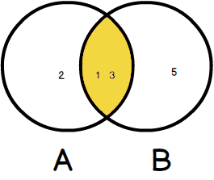
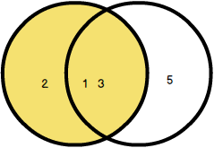
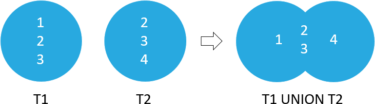
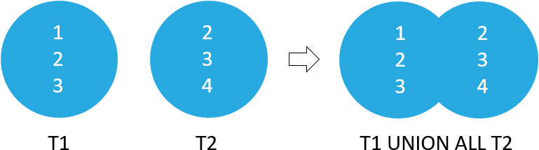

.. role:: rfg
.. role:: ulined

Basic Queries
=============
Source: https://www.sqlitetutorial.net

Query data from tables
----------------------
General order
`````````````
.. code-block:: sql

    FROM table_list
      JOIN table ON join_condition
    WHERE row_filter
    ORDER BY column
    LIMIT count OFFSET offset
    GROUP BY column
    HAVING group_filter;

Basic
`````
Select all items from a table

.. raw:: html

    <div class="highlight">
    <pre>
    <span style="color:red;">SELECT</span> * <span style="color:red;">FROM</span> tableA;
    </pre>
    </div>

Select all items from a table column

.. code-block:: sql

    SELECT columnA FROM tableA;

Select all items from several table columns

.. code-block:: sql

    SELECT columnA, columnB FROM tableA;

Rename resulting column names
`````````````````````````````
Renaming column names of resulting matches

.. raw:: html

    <div class="highlight">
    <pre>
    SELECT columnA <span style="color:red;">AS</span> foo, columnB AS bar FROM tableA;
    </pre>
    </div>

Define value for additional columns
```````````````````````````````````
Each row will receive the value ‘MyValue’ in column ’Type’

.. raw:: html

    <div class="highlight">
    <pre>
    SELECT columnA, <span style="color:red;">'</span>MyValue<span style="color:red;">'</span> AS Type FROM tableA;
    </pre>
    </div>

No duplicates
`````````````
Select items without duplicate values (single column) or combination (multiple columns)

.. raw:: html

    <div class="highlight">
    <pre>
    SELECT <span style="color:red;">DISTINCT</span> columnA FROM tableA;
    </pre>
    </div>

.. code-block:: sql

    SELECT DISCTINCT columnA, columnB FROM tableA;

Order results by columnA primarily, secondarily by columnB

.. code-block:: sql

    SELECT columnA, columnB FROM tableA ORDER BY columnA ASC, columnB ASC;

Order results by column ID (here: columnB = 2, columnC = 3)

.. code-block:: sql

    SELECT columnA, columnB, columnC FROM tableA ORDER BY 2 ASC, 3 ASC;

Filter results
``````````````
Basic syntax

.. raw:: html

    <div class="highlight">
    <pre>
    SELECT column_list FROM table <span style="color:red;">WHERE</span> search_condition;
    </pre>
    </div>

Comparison operators

+-----------+---------------------------+
| Operator  | Meaning                   |
+===========+===========================+
| =         | Equal to                  |
+-----------+---------------------------+
| <> or !=  | Not equal to              |
+-----------+---------------------------+
| <         | Less than                 |
+-----------+---------------------------+
| >         | Greater than              |
+-----------+---------------------------+
| <=        | Less than or equal to     |
+-----------+---------------------------+
| >=        | Greater than or equal to  |
+-----------+---------------------------+

Logical operators

+----------+--------------------------------------------------------------------------------------+
| Operator | Meaning                                                                              |
+==========+======================================================================================+
| AND      | returns 1 if both expressions are 1, and 0 if one of the expressions is 0.           |
+----------+--------------------------------------------------------------------------------------+
| BETWEEN  | returns 1 if a value is within a range.                                              |
+----------+--------------------------------------------------------------------------------------+
| EXISTS   | returns 1 if a subquery contains any rows.                                           |
+----------+--------------------------------------------------------------------------------------+
| IN       | returns 1 if a value is in a list of values.                                         |
+----------+--------------------------------------------------------------------------------------+
| LIKE     | returns 1 if a value matches a pattern                                               |
+----------+--------------------------------------------------------------------------------------+
| NOT      | reverses the value of other operators such as NOT EXISTS, NOT IN, NOT BETWEEN, etc.  |
+----------+--------------------------------------------------------------------------------------+
| OR       | returns true if either expression is 1                                               |
+----------+--------------------------------------------------------------------------------------+

Single condition (value from column)

.. code-block:: sql

    SELECT columnA FROM tableA WHERE columnA > 5000;

Multiple conditions

.. raw:: html

    <div class="highlight">
    <pre>
    # must all be true
    SELECT columnA, columnB FROM table WHERE columnA > 5000 <span style="color:red;">AND</span> columnB = 10;

    # at least one must be true
    SELECT columnA, columnB FROM table WHERE <span style="color:red;">ANY</span> columnA > 5000 AND columnB = 10;
    </pre>
    </div>

    Search value containing a substring (LIKE) -> case-insensitive

.. raw:: html

    <div class="highlight">
    <pre>
    # must all be true
    SELECT columnA FROM table WHERE columnA <span style="color:red;">LIKE</span> ‘%foobar_’;
    </pre>
    </div>

.. hint::

    +---+---------------------------------+
    | % | matches zero or more characters |
    +---+---------------------------------+
    | _ | matches a single character      |
    +---+---------------------------------+

Search value that contains any of the wildcard characters (``%`` or ``_``)
(here: ‘\' is used as escape character)

.. raw:: html

    <div class="highlight">
    <pre>
    SELECT columnA FROM table WHERE columnA LIKE ’%50\%%’ <span style="color:red;">ESCAPE</span> ‘\’;
    </pre>
    </div>

Search value containing a substring (GLOB) -> case-sensitive

.. raw:: html

    <div class="highlight">
    <pre>
    SELECT columnA FROM table where columnA <span style="color:red;">GLOB</span> ‘?Man*’;
    </pre>
    </div>

.. hint::

    +----+---------------------------------+
    | \* | matches zero or more characters |
    +----+---------------------------------+
    | ?  | matches a single character      |
    +----+---------------------------------+

Search if value within a range of allowed values

.. raw:: html

    <div class="highlight">
    <pre>
    SELECT columnA FROM table WHERE columnA <span style="color:red;">IN</span> (10,20,30);
    </pre>
    </div>

Search if value is between two values (value itself are included)

.. raw:: html

    <div class="highlight">
    <pre>
    SELECT columnA FROM table WHERE columnA <span style="color:red;">BETWEEN</span> 1 <span style="color:red;">AND</span> 10;
    </pre>
    </div>

Search if value is not between two values (values itself are not included

.. raw:: html

    <div class="highlight">
    <pre>
    SELECT columnA FROM table WHERE columnA <span style="color:red;">NOT</span> BETWEEN 100 and 199;
    </pre>
    </div>

Limit results
`````````````
Limit the amount of rows to return (here: 10)

.. raw:: html

    <div class="highlight">
    <pre>
    SELECT columnA FROM table <span style="color:red;">LIMIT</span> 10;
    </pre>
    </div>

Limit with an offset (start at nth row of the results, here: 30)

.. raw:: html

    <div class="highlight">
    <pre>
    SELECT columnA FROM table LIMIT 10 <span style="color:red;">OFFSET</span> 30;
    </pre>
    </div>

Join data from multiple tables
``````````````````````````````
Usually foreign keys are used in these conditions (here: someID), which exists in all joined tables.

Returns row only if condition matches (here: someID value exists for both a row in tableA and tableB)
-> INNER JOIN

.. raw:: html

    <div class="highlight">
    <pre>
    # regular
    SELECT columnA, columnB FROM tableA <span style="color:red;">INNER JOIN</span> tableB <span style="color:red;">ON</span> tableB.sameID = tableA.someID;

    # shortened via aliases
    SELECT A.columnA, B.ColumnB FROM tableA A INNER JOIN tableB B ON A.someID = B.someID;

    # shortened using USING
    SELECT columnA, columnB FROM tableA INNER JOIN tableB <span style="color:red;">USING</span>(tableA.someID);

    # 2+ tables
    SELECT someID, tableA.columnA, tableB.columnB, tableC.columnC
    FROM tableA
    INNER JOIN tableB ON tableB.someID = tableA.someID
    INNER JOIN tableC ON tableC.someID = tableB.someID;
    </pre>
    </div>



    Inner Join

Adding additional condition(s)

.. code-block:: sql

    SELECT columnA, columnB FROM tableA INNER JOIN tableB USING(tableA.someID) WHERE columnA < 10;

Returns any row, but uses NULL (here: for columnB value) if “right” table does not have a
matching row -> LEFT JOIN

.. raw:: html

    <div class="highlight">
    <pre>
    # regular
    SELECT columnA, columnB FROM tableA <span style="color:red;">LEFT JOIN</span> tableB ON tableA.someID = tableB.someID;

    # using USING
    SELECT columnA, columnB FROM tableA LEFT JOIN tableB USING (tableA.someID);
    </pre>
    </div>



    Left Join

Creates a Cartesian product of tables (i.e. all possible column combinations)

.. raw:: html

    <div class="highlight">
    <pre>
    SELECT columnA FROM tableA <span style="color:red;">CROSS JOIN</span> tableB;
    </pre>
    </div>

Join various columns of a table with itself

.. code-block:: sql

    SELECT columnA1, colummA2 FROM tableA a1 INNER JOIN tableA a2 ON a1.someID = a2.anotherID;

Split result into group
```````````````````````
Display count results as groups (one row per resulting group) while using an
aggregate function (e.g. COUNT)

.. raw:: html

    <div class="highlight">
    <pre>
    SELECT columnA, <span style="color:red;">COUNT</span>(someID) FROM tableA <span style="color:red;">GROUP BY</span> columnA;

    # more real example (returns number of tracks per album)
    SELECT albumid, COUNT(trackid) FROM tracks GROUP BY albumid;
    </pre>
    </div>

Without the group by statement, all values for “notuniqueID” are just counted (which returns
number of not NULL values for this column). The GROUP BY statement splits up this count to
the various values in columnA

Combine with INNER JOIN

.. code-block:: sql

    SELECT tableA.columnA1, columnA2, COUNT(someID)
    FROM tableA
    INNER JOIN tableB ON tableB.columnA1 = tableA.columnA1
    GROUP BY tableA.columnA1;

Returns only results that have match on tableB.
Please note that *tableA.columnA1* must be specified after SELECT, since both *tableA* and *tableB* have this column.

MAX, MIN and AVG functions

.. raw:: html

    <div class="highlight">
    <pre>
    SELECT tableA.columnA1, <span style="color:red;">min</span>(columnA2), <span style="color:red;">max</span>(columnA2), <span style="color:red;">round</span>(<span style="color:red;">avg</span>(columnA2),2)
    FROM tableA
    INNER JOIN tableB ON tableB.columnA1 = tableA.columnA1
    GROUP BY tableA.columnA1;
    </pre>
    </div>

Grouping by multiple columns (will create all combination values of columnA1 and columnA2 as groups)

.. code-block:: sql

    SELECT columnA1, columnA2, count(someID) FROM tableA GROUP BY columnA1, columnA2;

Filter groups
`````````````
The HAVING clause can only be applied to group results

Direct value

.. raw:: html

    <div class="highlight">
    <pre>
    SELECT columnA, COUNT(someID) FROM tableA GROUP BY columnA <span style="color:red;">HAVING</span> columnA = 1;
    </pre>
    </div>

Value range

.. raw:: html

    <div class="highlight">
    <pre>
    SELECT columnA, COUNT(someID) FROM tableA GROUP BY columnA HAVING count(someID) <span style="color:red;">BETWEEN</span> 18 <span style="color:red;">AND</span> 20;
    </pre>
    </div>

Combine multiple queries into single results
````````````````````````````````````````````
Combine two queries into one result (eliminating duplicates)

.. raw:: html

    <div class="highlight">
    <pre>
    SELECT columnA FROM tableA <span style="color:red;">UNION</span> 18 <span style="color:red;">AND</span> SELECT columnB from tableB;
    </pre>
    </div>

-> results from columnB are merged into columnA results (no duplicates)

Combine two queries into one result (including duplicates)

.. raw:: html

    <div class="highlight">
    <pre>
    SELECT columnA FROM tableA <span style="color:red;">UNION ALL</span> 18 <span style="color:red;">AND</span> SELECT columnB from tableB;
    </pre>
    </div>

-> results from columnB are merged into columnA results (including duplicates)



    Union



    Union All

Filter out results from left query that has a match in right query

.. raw:: html

    <div class="highlight">
    <pre>
    SELECT columnA FROM tableA <span style="color:red;">EXCEPT</span> SELECT columnA FROM tableB;
    </pre>
    </div>

Return rows that are output of two queries
``````````````````````````````````````````
.. note::

    Both data value and data type must be equal.

.. raw:: html

    <div class="highlight">
    <pre>
    SELECT columnA FROM tableA <span style="color:red;">INTERSECT</span> SELECT columnB FROM tableB;
    </pre>
    </div>

.. figure:: _img/intersect.png
    :align: center

    Intersect

Subqueries
``````````
Nest a SELECT statement into another ...

… within WHERE

.. code-block:: sql

    SELECT columnA, columnB
    FROM tableA
    WHERE columnA IN (
        SELECT columnB
        FROM tableB
        WHERE columnC = 10
    );

… within FROM

.. code-block:: sql

    SELECT columnA
    FROM (
        SELECT
        SUM(columnB) SIZE
        FROM tableB
        GROUP BY some_id
    ) AS columnB_subset;

Check if subquery returns any result:

* Zero -> False
* One or more -> True

Only return row if tableB has same value in its columnA

.. raw:: html

    <div class="highlight">
    <pre>
    SELECT columnA FROM tableA A WHERE <span style="color:red;">EXISTS</span> ( SELECT columnA from tableB WHERE columnA = A.columnA );
    </pre>
    </div>

.. note::

    Some EXISTS operations can also be done with IN, but EXISTS in faster.

Only return row if tableB does :ulined:`not` have that value in its columnA

.. raw:: html

    <div class="highlight">
    <pre>
    SELECT columnA FROM tableA A WHERE <span style="color:red;">NOT EXISTS</span> ( SELECT columnA from tableB WHERE columnA = A.columnA );
    </pre>
    </div>

CASE … WHEN … THEN … ELSE … END
```````````````````````````````
Set value ‘foo’ for columnB value, if column contains the value 1 otherwise set ‘bar'

.. raw:: html

    <div class="highlight">
    <pre>
    SELECT columnA, <span style="color:red;">CASE</span> columnB <span style="color:red;">WHEN</span> '1' <span style="color:red;">THEN</span> 'foo' <span style="color:red;">ELSE</span> 'bar' FROM tableA;
    </pre>
    </div>

Can also be used with other comparisons (set columnB to ‘little’, ‘medium’ or ‘large’ depending on its integer value)

.. raw:: html

    <div class="highlight">
    <pre>
    SELECT columnA,
        <span style="color:red;">CASE</span>
            WHEN columnB < 1000 THEN ‘little’
            WHEN columnB >= 1000 AND columnB < 10000 THEN ‘medium’
            ELSE ‘large’
        <span style="color:red;">END</span> columnB
    FROM tableA;
    </pre>
    </div>

Add & Update data
-----------------
Insert new data values to table
```````````````````````````````
Insert single row to table

.. raw:: html

    <div class="highlight">
    <pre>
    <span style="color:red;">INSERT INTO</span> tableA (columnA,columnB) <span style="color:red;">VALUES</span>(‘hello’,1);
    </div>

Insert multiple rows

.. code-block:: sql

    INSERT INTO tableA (columnA, columnB)
    VALUES
        ('Hello', 1),
        ('World', 2),
        ('Here', 3),
        ('I', 4),
        ('Am', 5)

Insert default values (increment ID columns, add NULL to others)

.. raw:: html

    <div class="highlight">
    <pre>
    INSERT INTO tableA <span style="color:red;">DEFAULT</span> VALUES;
    </div>

Insert values provided by SELECT statement

.. code-block:: sql

    INSERT INTO tableA_backup SELECT columnA, columnB FROM tableA;

Change column data
``````````````````
Update single column under condition

.. raw:: html

    <div class="highlight">
    <pre>
    <span style="color:red;">UPDATE</span> tableA <span style="color:red;">SET</span> columnA = 'some value' WHERE columnB = 10;
    </div>

Update multiple columns

.. code-block:: sql

    UPDATE tableA SET columnA = 'some value', columnX = 0, columnY = 'valueA' WHERE columnB = 10;

Update using other column's values

.. code-block:: sql

    UPDATE tableA SET columnA = LOWER(columnB || "." || columnC || "@example.com") ORDER BY columnA LIMIT 1;

Delete data
```````````
Delete entire rows

.. raw:: html

    <div class="highlight">
    <pre>
    <span style="color:red;">DELETE</span> FROM tableA WHERE columnB = 10;
    </div>

Delete all rows from table

.. code-block:: sql

    DELETE FROM tableA;

Replace rows (Delete + Add)
```````````````````````````
If **no** unique index column is defined for a table, a REPLACE statement will simply add the values (same as INSERT).

Define a unique index (here: columnA) -> two rows cannot have the same value for columnA

.. raw:: html

    <div class="highlight">
    <pre>
    <span style="color:red;">CREATE UNIQUE INDEX</span> columnA <span style="color:red;">ON</span> tableA (columnA);
    </div>

Replace single column

.. raw:: html

    <div class="highlight">
    <pre>
    <span style="color:red;">REPLACE INTO</span> tableA (columnA, columnB) VALUES ('some value', 10);
    </div>

REPLACE deletes the old row and inserts a new one. A primary identifier column will receive the next available id, but not the one from
the deleted row.

Transaction
```````````
*coming later*

https://www.sqlitetutorial.net/sqlite-transaction/