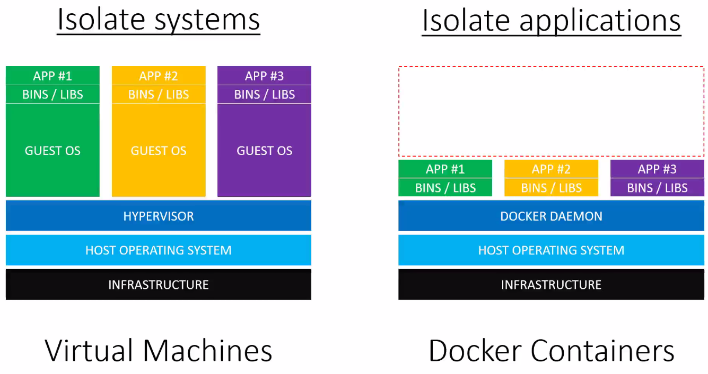
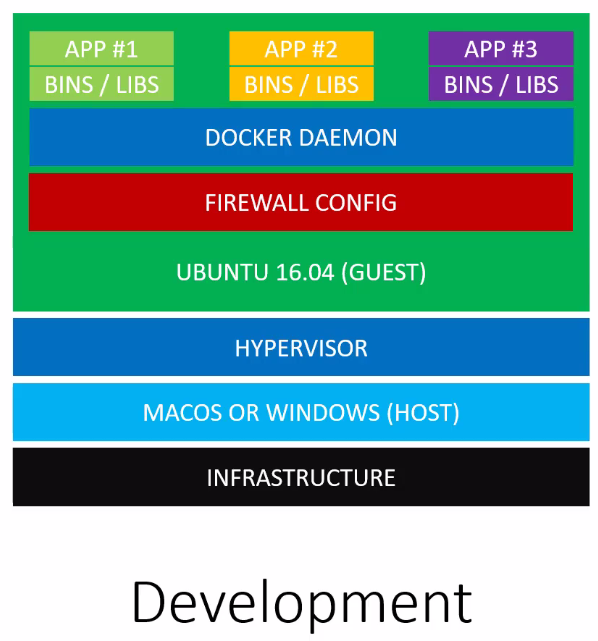
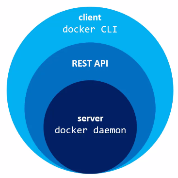
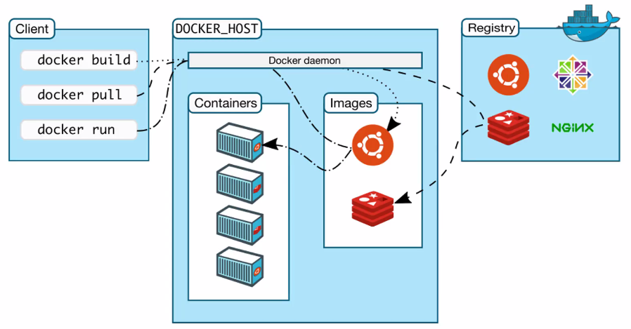

02 - Understanding Docker
=========================

Docker vs. VMs
--------------

* VMs run on a host system
* Each VM has its own Guest OS, which are independent from other VMs running on the same host OS
* Docker runs on a host system and controls multiple docker images via the docker daemon
* Compared to VMs, Docker images are loaded within milliseconds (as compared to minutes for a VM),
  but all docker images share the same host operating system, they are interacting with

**When to use VMs, when docker?**

* When each application requires different host OSs or different host OSs settings, then
  VMs are the choice
* When multiple application can rely on the same OS and OS settings, then docker is the choice
* A VM can have Docker installed, providing a different host OS, that the docker images require

* Docker is suitable for running and testing process or services in isolation (e.g. each
  component of a web application)
* Docker is not limited to web apps (but can be like a package manager for applications,
  for example applications that were not even designed to work on your OS)

-> Use VMs to run and test entire system
-> Use Docker to run and test single applications

* Docker applications can be deployed on many cloud server (e.g. AWS, Azure, DigitalOcean)
* There, they are running on VMs, that are set up for you
* Docker can run on almost any host OS

What does a Docker installation consist of?
-------------------------------------------

#. Docker daemon
#. CLI (command line interface)

* Docker daemon is a service that runs on the host OS (only runs on Linux as it depends on
  various Linux kernel features)
* Docker daemon exposes a REST API. A number of tools can talk to the daemon through it,
  most known is the docker CLI
* Daemon is like the server and the CLI the client
* There are other third party clients able to interact the daemon (for various programming
  languages)

* The docker client is installed on your local OS (Linux, OSX, Windows)
* The docker daemon is installed on the docker host (a Linux machine or VM)
* The registry is a part of the docker ecosystem (explained later)

