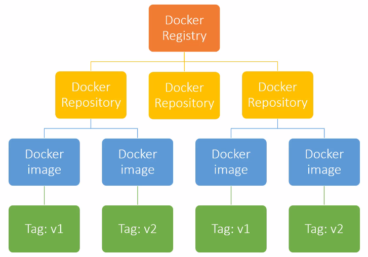

04 - Discovering Docker
=======================
Image vs. Container
-------------------
* A docker image is a combination of a file system and parameter, which contains everything
  you need to run a file
* A docker image has no state attach to it
* A docker image can be downloaded, built and run
* A docker container is like an instance of a docker image
* A docker image can contain many containers
* A docker image is the result of a build process (defined in a Dockerfile)
* Docker containers are immutable, so changes made in them during run are commonly lost after
  the container is closed

Start a container

.. prompt:: bash

    docker run -it <image_name> <application>

    e.g. ``docker run -it alpine sh`` which starts the shell on the alpine image

Multiple containers of the same image can be accessed / opened  at the same time (while changes
to one container does not affect the others)

-> Running a docker images creates a docker container

Downloading and storing images
------------------------------
* The Docker Hub contains various images ready for download
* The Docker Hub is a Docker Registry
* A Docker Registry is a place where to store your docker images
* A Docker Registry contains various Docker Repositories
* In a Docker Repository resides a collection of equally named Docker images
* Each of these images can be distinguished by it tag (which is the version of an image)

-> Docker Hub (https://hub.docker.com/) is like Github, but for Docker images (place to get
other images and to publish your own images, either public or private)

    * Docker Hub has official images and public (third party) images
    * Third party images can be recognized by the additional namespace for the pull command
      e.g. docker pull nickjj/faye

Run an image from a url:

.. prompt:: bash

    docker run <image_url>

e.g. ``docker run docker.io/library/hello-world``

Since this is an official repo, you can simply run

.. prompt:: bash

    docker run hello-world

Docker build process
--------------------
* Two ways to build a docker image

    #. *docker commit* ... (commit changes to current image -> creates a new image layer
       containing changes) -> won't be used in this tutorial
    #. Dockerfile (recipe book to create a docker image) -> superior method

* Docker images have layers
* Each layer is like a self-contained file
* A docker image is a stack of multiple layers

    .. image:: _file/04_discover/layers.png

* Image layers work like in a git repo -> only changed layers are updated
