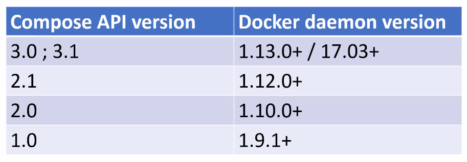
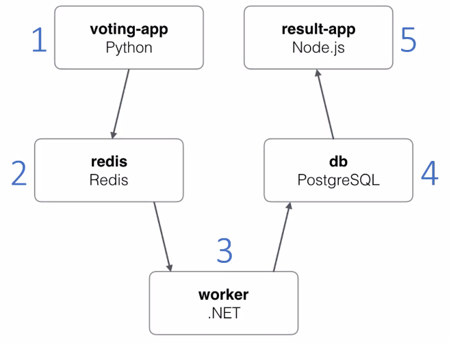

06 - Docker Compose Workshop
============================
Adding docker compose support
-----------------------------
* Docker compose uses a \*.yml file to define all containers settings (previously
  passed as arguments to the 'docker' CLI commands)
* The docker compose file doesn't have to be in the same directory as the dockerfile(s)
  but can reference them relatively to its own location (e.g. ./projectA)

Define docker compose API version

.. raw:: html

    

    <pre>
    version: '3'
    </pre>
    

Define services (image + containers)

.. raw:: html

    

    <pre>
    services:
      redis
        # redis properties here
      web:
        # web application properties here
    </pre>
    

* services lists all available images
* here ‘redis’ and ‘web’ will be the name of the image and the container

**Inside the services:**

.. raw:: html

    

    <pre>
    image: 'redis:5.0-alpine'
    image: 'nickjj/web:1.0' # from public docker hub
    </pre>
    

defines the docker image to be used (pulled down if not already existing)

.. raw:: html

    

    <pre>
    build: '.'
    </pre>
    

defines the image is to be built (not pulled) -> location must point to the dockerfile
location

    * the docker-compose.yml file does not have to be in the same directory as the
      docker file (but might be one level higher)

.. raw:: html

    

    <pre>
    ports:
      - '5000:5000'
    </pre>
    

defines ports to be opened for this service (multiple ports are possible)

    * list entries start with a ‘-‘ (ports excepts values in form of a list)

.. raw:: html

    

    <pre>
    volumes:
      - '.:/app'
    </pre>
    

defines a volume to be exposed (here the current directory '.' is exposed in '/app’.
Note that ‘.’ can be used instead of $PWD as in the docker CLI command, even on Windows)

.. code-block:: none

    volumes:
      - 'redis:/data'

exposes a named volume 'redis' inside '/data'

Here, the named volumed must be specified in a 'volumes' properties (outside 'services'):

.. raw:: html

    

    <pre>
    volumes:
      redis:  {}
    </pre>
    

The {} can accept arguments (for example read-only) -> see `Docker documentation
<https://docs.docker.com/compose/compose-file/07-volumes/>`__

.. raw:: html

    

    <pre>
    depends_on:
      - 'redis'
    </pre>
    

tells docker, that that service *depends* on 'redis' (other service) to make sure,
that 'redis' is launched before the services that contains this property (multiple
dependencies can be added)

**Adding environmental variables** -> two ways

First one (explicit):

.. raw:: html

    

    <pre>
    environment:
      FLASK_DEBUG: 'true'
    </pre>
    

Second one (referencing file):

.. raw:: html

    

    <pre>
    env_file:
      - '.env'
    </pre>
    

is better to manage different sets of variables e.g.

.. code-block:: none

    env_file:
      - '.env'
      - '.env_production'

in which case, that ladder file overrides present key-values of the first file

Env files can contain `compose CLI environmental variables <https://docs.docker.com/compose/environment-variables/envvars/>`__

**COMPOSE_PROJECT_NAME** should always be set, otherwise the current directory name is
used as project name and prefixes images and containers names with it (e.g. web2)

-> the ‘web’ image will now be named ‘<COMPOSE_PROJECT_NAME>_<services_name>:<version>
so in our case *web2_web:latest*

PYTHONBUFFERED=true must be set to see the applications output (Python) in the terminal
when running docker compose

.. note::

    In Python there is only the PYTHONUNBUFFERED env var
    (see `here <https://docs.python.org/3.7/using/cmdline.html#environment-variables>`__)

Managing the application (web) with compose
-------------------------------------------
Get docker compose help

.. raw:: html

    

    <pre>
    docker-compose --help
    </pre>
    

* docker-compose expects a *docker-compose.yml* file to be in the current directory
* if not, the **-f** flag allows to specify the location a one or multiple docker-compose.yml files

Build an image

.. raw:: html

    

    <pre>
    docker-compose build
    </pre>
    

* the build image has the name 'web2_web'
* 'web2' is the name we defined in <COMPOSE_PROJECT_NAME>
* 'web' is the service name defines in docker-compose.yml

Get required images for the application

.. raw:: html

    

    <pre>
    docker-compose pull
    </pre>
    

-> here this downloads the redis image

Run the application (all services specified in \*.yml)

.. raw:: html

    

    <pre>
    docker-compose up
    </pre>
    

* creates a default network for the application (here 'web2_default')
* creates a container for dependencies docker image (here redis, so 'web2_redis_1)
* creates a container for web application image (here 'web2_web_1')
* executes dockerfile (including entrypoint script) which launches the app

Run single service (and possible dependency services)

.. raw:: html

    

    <pre>
    docker-compose up &lt;service_name&gt;
    </pre>
    

When running several instances of the application, those will get incrementing index
numbers (e.g. web2_web_1, web2_web_2, web2_web_3) -> requires random application ports,
though

Combining build + pull + up in one command:

.. raw:: html

    

    <pre>
    docker-compose up --build -d
    </pre>
    

(**-d** makes the process run in the background)

.. raw:: html

    

    <pre>
    docker-compose ps
    </pre>
    

lists all container of the current project (even stopped ones)

.. raw:: html

    

    <pre>
    docker-compose logs -f
    </pre>
    

prints out recent logs from all containers associated with the docker-compose project
(here: ‘web' and ‘redis'). The **-f** flag defines to follow along with new logs
appearing

Restart all containers

.. raw:: html

    

    <pre>
    docker-compose restart
    </pre>
    

Restart particular container (service)

.. raw:: html

    

    <pre>
    docker-compose restart &lt;service_name&gt;
    </pre>
    

e.g. ``docker-compose restart redis``

Execute a command on a running service

.. raw:: html

    

    <pre>
    docker-compose exec &lt;service_name&gt; &lt;command&gt;
    </pre>
    

e.g. ``docker-compose exec web ls -la``

Notice, that the -it flags are **not** needed here (are automatically added by
docker-compose)

Start a service & execute a command on it & remove that container again

.. raw:: html

    

    <pre>
    docker-compose run &lt;service_name&gt; &lt;command&gt;
    </pre>
    

e.g. ``docker-compose run redis redis-server --version``

* this starts a new container, but doesn't bind a port
* container is removed after command is executed

Stop all running containers

.. raw:: html

    

    <pre>
    docker-compose stop
    </pre>
    

Stop a single container

.. raw:: html

    

    <pre>
    docker-compose stop &lt;service_name&gt;
    </pre>
    

Remove all stopped containers

.. raw:: html

    

    <pre>
    docker-compose rm
    </pre>
    

.. hint::

    Override application commands:

    Add command to your docker-compose.yml service:

    .. code-block:: none

        services:
          some_service:
            command: flask run --host=0.0.0.0 --port=5001

    Here, we changed the application port 5000 -> 50001

    -> a docker-compose.yml command always overrides a Dockerfile command (CMD)

**Building an image + creating a tagged version of it**

Add *both* a **build** and a **image** property to a service:

.. code-block:: none

    services:
      some_service:
        build: '.'
        image: 'wohletzar/some_service:1.0'

When running docker-compose build, both images are created (build version is created
first, tagged one (here: wohletzar/some_service:1.0) after that).

Docker Compose API v1/v2/v3
---------------------------

* all versions are backwards compatible, so v2 and v3 can be chosen with the lastest
  docker daemon
* v1 is legacy and should be avoided (no version property)
* each API versions require a minimum docker daemon version
* latest version recommended
* Docker Compose offer regular updates independent from the docker daemon
  -> upgrade regularly

Managing Microservices with Docker Compose
------------------------------------------
Example: Voting Web-App

* Microservices-based architecture
* for example, the flask app has no idea there is anything beyond redis
* flask app can be exchanged by, for instance, Ruby on Rails, without changing any
  other service

A big advantage is, that you don't have to understand the single services internals
to make the application work

    #. Install the docker application from src folder (docker-compose run --build)
    #. 0.0.0.0:5000 and :5001 show proper content

.. important::

    Changes made to the services src files are handled differently from language to
    language:

        * **Interpreted languages** (Python, HTML, ...) can be changed and applied to
          running services without rebuilding the image. The new files are directly
          copied into the images when they are saved.
        * **Compiled languages** (C#, C++, ...) require that the changed images is rebuild,
          since the compiled files are needed for execution

    `https://en.wikipedia.org/wiki/List_of_programming_languages_by_type <https://en.wikipedia.org/wiki/List_of_programming_languages_by_type#Interpreted_languages>`__

docker-compose.yml:

    * using back-tier and front-tier networks
    * backend services (redis, worker, db) are connected with each other via the
      back-tier network
    * frontend services (voting-app, result-app) are connected with each other via the
      front-tier network to talk to each other and also to the back-tier network to
      communicate with the backend services

    .. code-block:: none

        services:
          vote:
            networks:
              - front-tier
              - back-tier

        networks:
          front-tier:
          back-tier:

    * all services contain a reference to where they are located, e.g.

    .. code-block:: none

        services:
          vote:
            build: -/vote
            volumes:
              - ./vote:/app

    * the worker service (C#) does not contain a volume, because it must be compiled.
      Accessing the files via a volume property does not work
