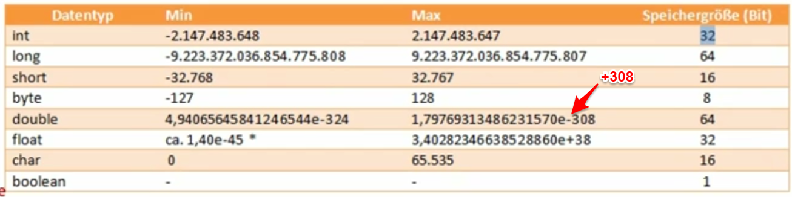

21. Primitive Datentypen
========================

* *float* wird standardmäßig als *double* gespeichert (höhere Genauigkeit) und
  benötigt ein ‘f’ um ihn nicht als *double* zu bezeichnen, z.B.: 3.455566f
* *long* wird standardmäßig als *int* gespeichert und benötigt ein ‘l’ sofern
  die Zahl außerhalb des Wertebereich liegt, z.B.: 400000000000L (großes L empfohlen)
* *char* ist ein einfaches Zeichen -> Wertebereich ist ein int, ist ein Verweis
  auf Unicode UTF-16 Zeichen
