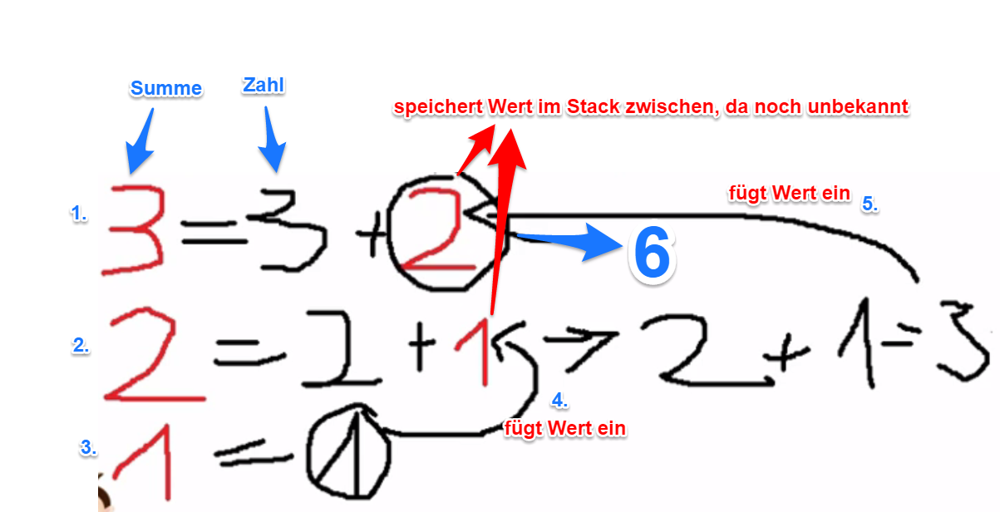

38. Rekursion
=============
.. admonition:: Definition

    Eine Methode ruft ihren Rumpf selbst auf -> benötigt eine Abbruchbedingung

**Beispiel:**

Programm soll die Summe einer Zahl berechnen (z.B. Summe aus 3: 3 + 2 + 1 = 6)

.. code-block:: java

    static long berechneSumme(int zahl)
    {
        if (zahl == 1)
        {
            return 1; // beendet Methode
        }
        return zahl + berechneSumme( zahl - 1);
    }

Rekursiv-Methode benötigt eine Abbruchbedingung (hier: return 1;), sonst wäre es
eine Endlosschleife.
