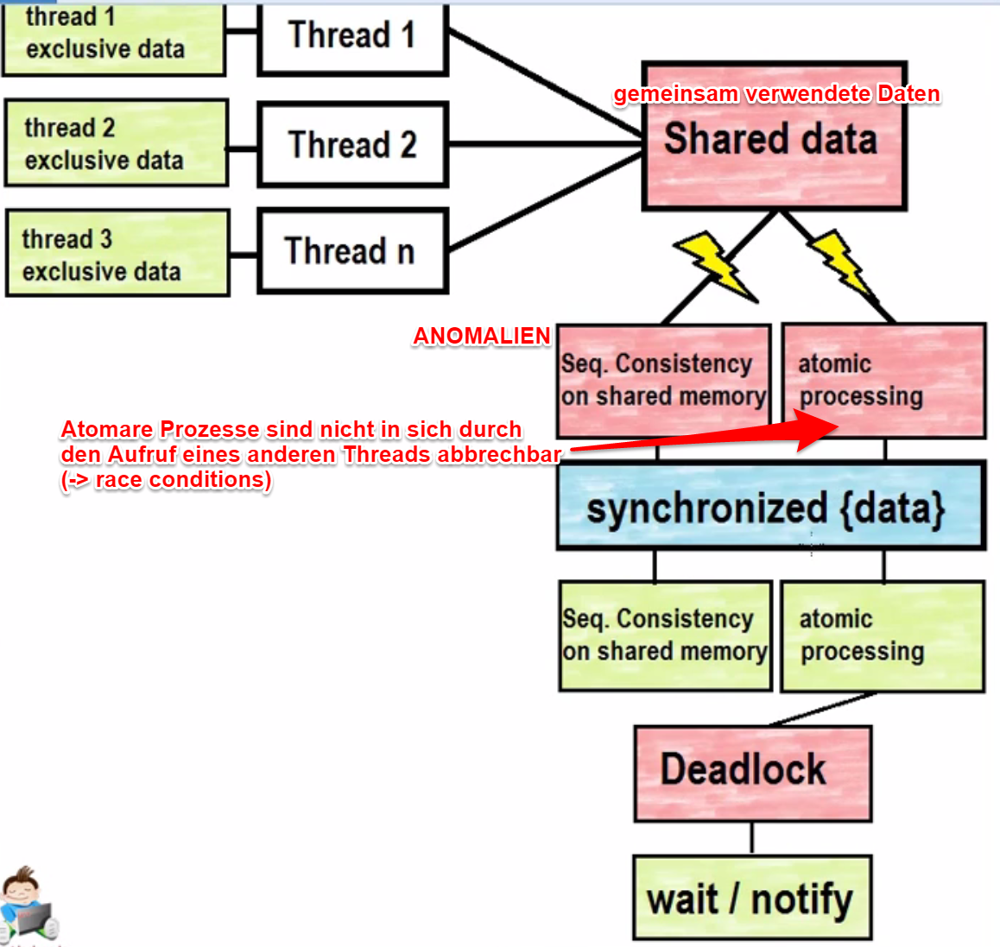

75. Deadlocks
=============
Synchronisierungen können sogenannte *Deadlocks* (Verklemmung) erzeugen:
Zwei oder mehr Threads können nicht fortsetzen, weil sie auf ein Ereignis warten, welches nur
ein Thread aus dieser Menge bewirken kann.

'Producer-Consumer' Problem:

* :download:`Pipeline.java <_file/75_deadlocks/Pipeline.java>`: Enthält put() und get() Methode
* :download:`Producer.java <_file/75_deadlocks/Producer.java>`: Legt etwas in die Pipeline -> put()
* :download:`Consumer.java <_file/75_deadlocks/Consumer.java>`: Holt etwas aus der Pipeline -> get()

Regel:

* Der Producer kann nur etwas in die Pipeline legen, wenn diese leer ist und wartet bis diese leer ist
* Der Consumer kann nur etwas aus der Pipeline holen, wenn diese etwas enthält und wartet
  bis diese etwas enthält

:Problem:

    Synchronisierte Threads beschlagnahmen das Lock der Methode put() oder lock() für sich
    und lassen einen Wechsel in einen anderen Thread nicht mehr zu z.B:

        #. die Pipeline ist leer
        #. Thread 0 möchte etwas herausholen -> wartet in der gelockten Methode get() bis
           etwas hineinkommt
        #. Thread 1 möchte etwas hineintun -> kommt nicht in die put(), da diese mit dem
           gleichen Lock auf get() synchronisiert ist

:ulined:`Lösung`:

:java:`Object.wait()`

    * gibt das Lock dieses Objekts wieder frei
    * Thread wird in einen Ruhezustand versetzt (undefinierte Länge)

:java:`Object.wait(long timeout)`

    * wie :java:`Object.wait()` aber mit definierter Zeitspanne für Ruhezustand des Threads

statt

.. code-block:: java

    while (data != null){
        ;  //busy waiting
    }

schreiben wir

.. code-block:: java

    while (data != null){
        try
        {
            wait();
        }
        catch (InterruptedException e )
        {
            e.printStackTrace();
        }
    }

Allerdings muss ein Thread wieder aufgeweckt werden, sobald dies Sinn macht

:java:`Object.notify()`

    * weckt einen einzelnen Thread auf, der zuvor ein wait() erhalten hat -> es
      kann nie explizit gesagt werden welcher
    * wird nur dann eingesetzt wenn es keine Rolle spielt welcher Thread als Erstes
      aufgeweckt wird (weil sie Ähnliches machen)

:java:`Object.notifyAll()`

    * weckt alle Threads auf, die zuvor ein wait() erhalten haben

Wichtig ist, dass zugeordnet wird, die Threads von welchem Lock aufgeweckt werden
sollen (Die Methoden wait() und notify() sind lock-spezifisch). Dafür muss zunächst
definiert werden für welches Lock ein wait() gelten soll:

.. code-block:: java

    while (data != null){
        try
        {
            this .wait();
        }
        catch (InterruptedException e )
        {
            e.printStackTrace();
        }
    }

Hier wird auf das aktuelle Pipeline Objekt selbst gelockt, also :java:`this.wait()`
Ansonsten muss auf das Lock eines bestimmten Objekt angegeben werden (z.B. :java:`lock.wait()`)

Die :java:`notifyAll()` Methode wird dann nach dem Abschluss (aber vor dem return)
eines synchronisierten Threads aufgerufen: :java:`this.notifyAll();`

.. admonition:: Faustregel

    Wo ein :java:`wait()` ist muss auch ein :java:`notify()` sein.

.. attention::

    Da man nie weiß, welcher Thread den anderen wieder aufweckt kann man in Endlosschleifen
    nicht mit if-else Bedingungen arbeiten:

    .. code-block:: java

        if(data != null){
            try
            {
                this .wait();
            }
            catch (InterruptedException e )
            {
                e.printStackTrace();
            }
        }

    Hier kann es sein, dass die Bedingung zum Zeitpunkt des Aufweckens nicht mehr gilt und
    die Aktionen zu unrecht durchgeführt werden z.B. ein Producer weckt einen anderen
    Producer -> diese überschreibt die Daten wieder

.. admonition:: Faustregel

    Eine :java:`wait()` Anweisung muss in eine while-Schleifen sein

    Zusammenfassende Grafik
