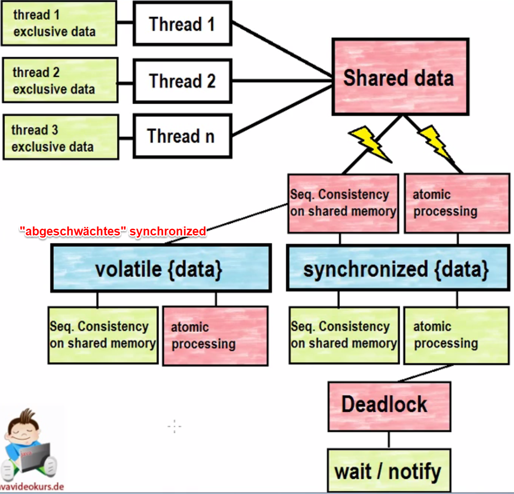

76. Keyword volatile
====================
* Die Synchronisation verlangsamt ein Multi-Threaded Program, ist aber nötig.
* Performance-Steigerung und trotzdem notwendige Sicherheit: keyword :java:`volatile`
* Wird nur bei Deklaration von Instanzvariablen und Klassenvariablen verwendet
  (lokale Variablen werden ohnehin nicht geteilt)

.. code-block:: java

    volatile boolean alive ;
    volatile long i ;

*Volatile* bedeutet:

* Jeder Thread muss vor einem Lesezugriff auf eine Volatile-Variable zuvor ein *refresh*
  auf seinen lokalen Speichern ausführen
* Jeder Thread muss nach einem Schreibzugriff auf eine Volatile-Variable einen *flush* ausführen

*Volatile* stellt die :ulined:`sequential consistency` her.

Warum ist *volatile* schneller als *synchronized*? --> Keine Logs

Volatile kann nur dann verwendet werden wenn :ulined:`keine race condition` auftreten kann.
Volatile besitzt :ulined:`keine Locks`.

Um volatile verwenden zu können dürfen daher nur atomare Zugriffe (nicht unterbrechbar) in den Anweisungen stehen
Atomare Zugriffe sind:

* einfacher Lesezugriff (z.B. :java:`while(true)`)
* einfache Zuweisungen von Referenzariablen auf primitiven und komplexen Datentypen
  (z.B. java:`c.alive = false;`). Ohne volatile wäre Zuweisung auf *long* und *double*
  kein atomarer Zugriff

x = x +1 ist keine einfache Zuweisung und daher nicht-atomar -> synchronized benötigt

Bei Unsicherheit stets *synchronized* verwenden

.. attention::

    Wird die Variable eines Objekts verändert (z.B. o.value = 10) so wird dieser Wert
    nicht automatisch geflusht, da der Wert der Variablen (o) nicht verändert wurde.
    Daher reicht bei komplexen Datentypen ein volatile i.d.R. nie aus, sondern es muss
    synchronisiert werden.

    Zusammenfassende Grafik
