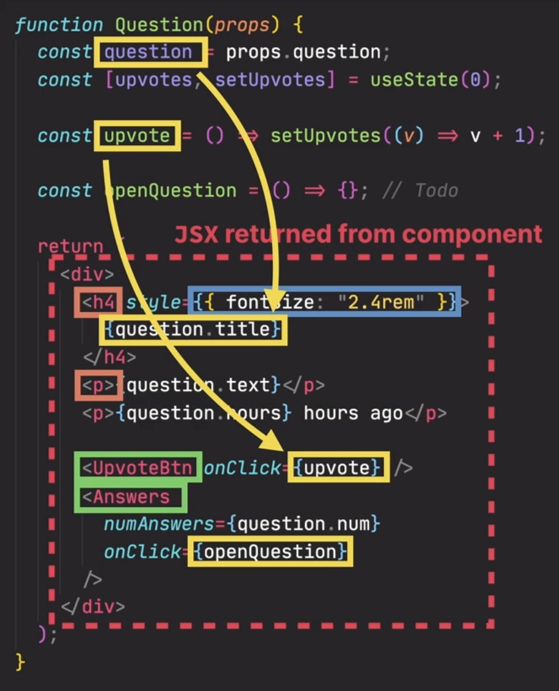
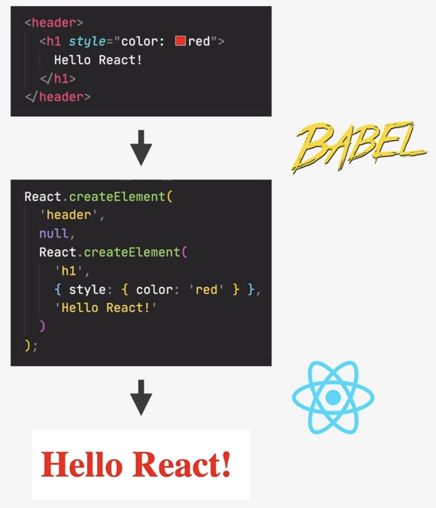
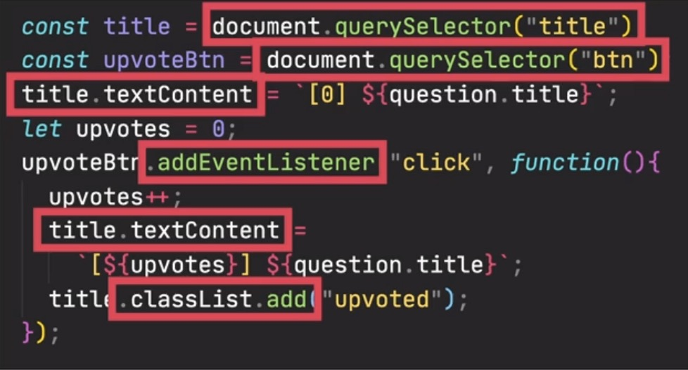
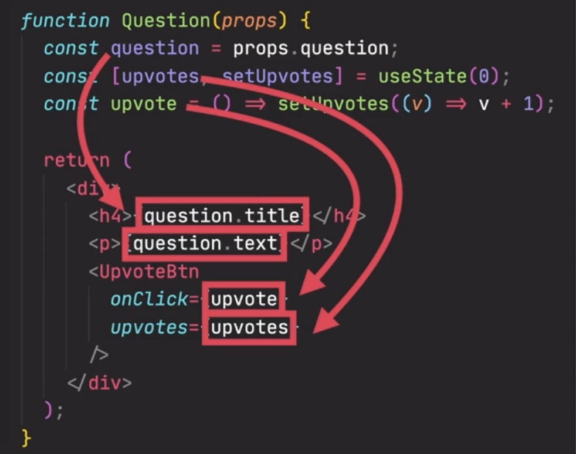

What is JSX?
============
* a **declarative** syntax to **describe** what components **looks like** and
  **how they work**
* components must **return** a block of JSX
* Extension of JavaScript that allows us to **embed JavaScript, CSS and React components**
  **into HTML**

    yellow = JavaScript; blue = CSS; green = Component; red = HTML

Each JSX element is **converted** to :javascript:`React.CreateElement()`
function call (JSX code is transformed into JavaScript) via an tool called `Babel`_
(a dependency of React), for example:

    JSX to JavaScript with Babel

These function calls in React generate the HTML (which the browser understands).

That's why, React could also be used **without JSX**.

**JSX is declarative**

Regular JavaScript is **imperative** ("tell, how to do things"):

    * manual DOM element selections and DOM traversing
    * step-by-step DOM mutations until we reach the desired UI

    --> approach unfeasible in more complex applications

React is **declarative** ("tell, what we want to see")

    * describe, what the UI should look like using JSX, **based on current data** (props & state)
    * happens without DOM manipulation (no elements queries, event listeners, ...)
    * React is an **abstraction** away from the DOM: **we never touch the DOM**
    * Instead, we think of the UI as a **reflection of the current data**

.. _Babel: https://babeljs.io/
