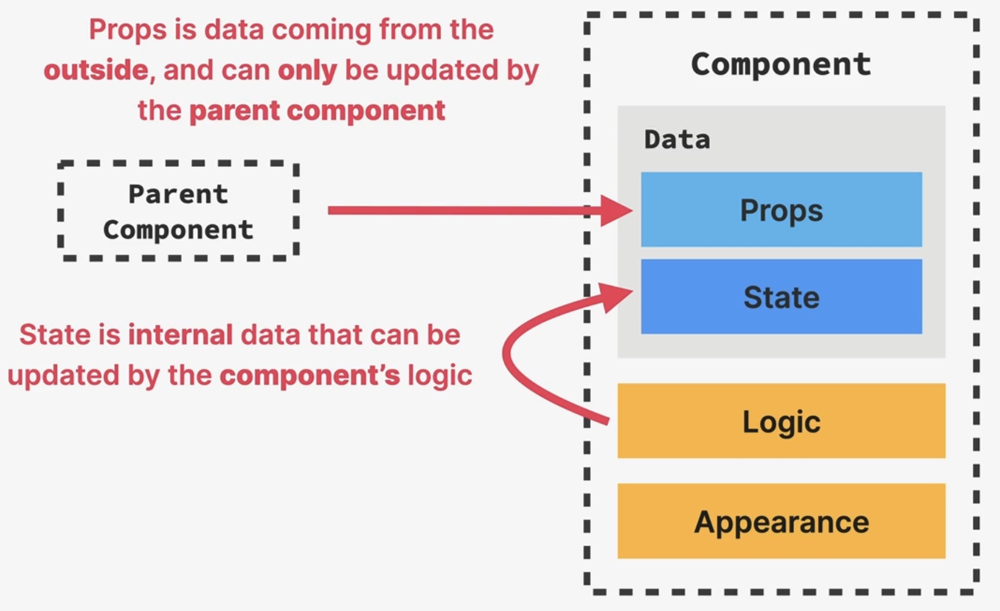

Props, Immutability and One-Way Data Flow
=========================================
* props are an essential tool to **configure** and **customize** components
* with props, parent components **control** how child components look and work
* **anything** can be passed as a prop (single values, arrays, objects, functions,
  even other components)

**Props are read-only**

* props are owned by the parent component, so the child component cannot change it

    Data contains *Props*  and *State* (among others)

* if props need to be mutated, **use state**
* Why?

    - If props were mutated, it will affect the parent component as well -> **side effect**
      (action, which affects data outside of the current scope/function)
    - components must be **pure functions** in terms of props and state
    - allows React for optimization and avoiding bugs

**One-Way Data Flow**

- data can **only** be passed **from parent to child components**, but not the other way
  (e.g. Angular allows two-way data flow)
- makes apps more predictable and easier to understand and debug
- more performant
