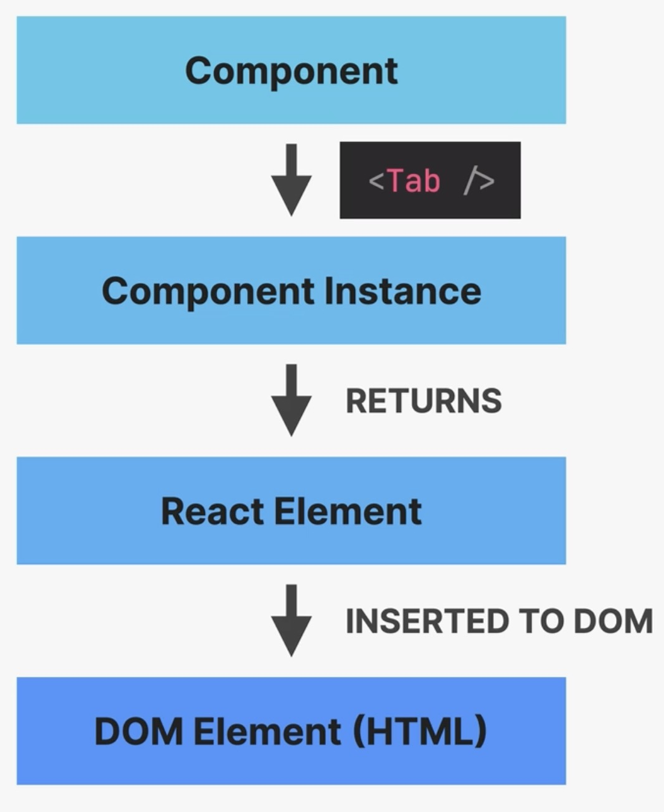

Components, Instances and Elements
==================================
* a component is a function, which returns an element using JSX
* an instance is a copy of a component
* JSX is converted to ``React.createElement()`` function calls, resulting in
  an element
* a React Element is converted to a DOM Element (HTML)

    Component, Instance, Element

Component instances can be logged to console using JSX:

.. code-block:: jsx

    function MyComponent() {
        return 
hell
;
    }

    console.log(<MyComponent/>);

React calls the MyComponent() function, which returns a **Component instance**.

Calling a component function directly simply returns the **React element** (which
we don't want), not the *component instance* - **never do this!**:

.. code-block:: jsx

    console.log(MyComponent());

Similarly, when calling the Component function directly within a JSX, for example:

.. code-block:: jsx
    :emphasize-lines: 19

    function Tabbed({ content }) {
      const [activeTab, setActiveTab] = useState(0);

      return (
        

          

            <Tab num={0} activeTab={activeTab} onClick={setActiveTab} />
            <Tab num={1} activeTab={activeTab} onClick={setActiveTab} />
            <Tab num={2} activeTab={activeTab} onClick={setActiveTab} />
            <Tab num={3} activeTab={activeTab} onClick={setActiveTab} />
          

          {activeTab <= 2 ? (
            <TabContent item={content.at(activeTab)} />
          ) : (
            <DifferentContent />
          )}

          {TabContent({ item: content.at(0) })}
        

      );
    }

that component is rendered and displayed, but **not added** to the component tree.
Moreover, the ``TabContent`` element above **becomes a prop of the parent component** (``Tabbed``),
for instance not allowing it to manage its own state.
