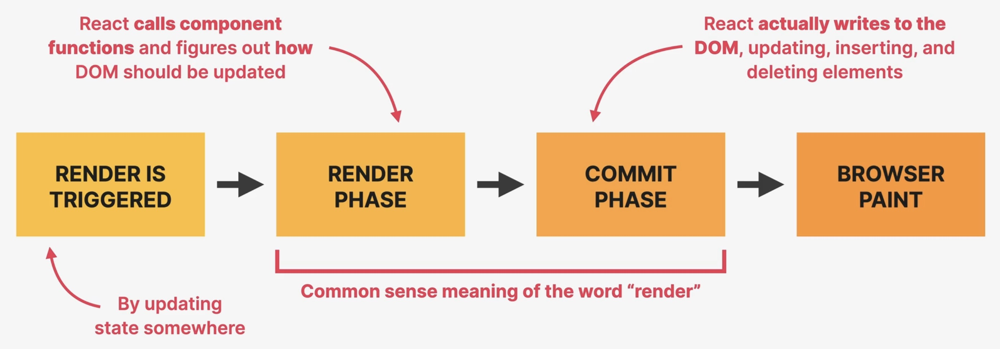
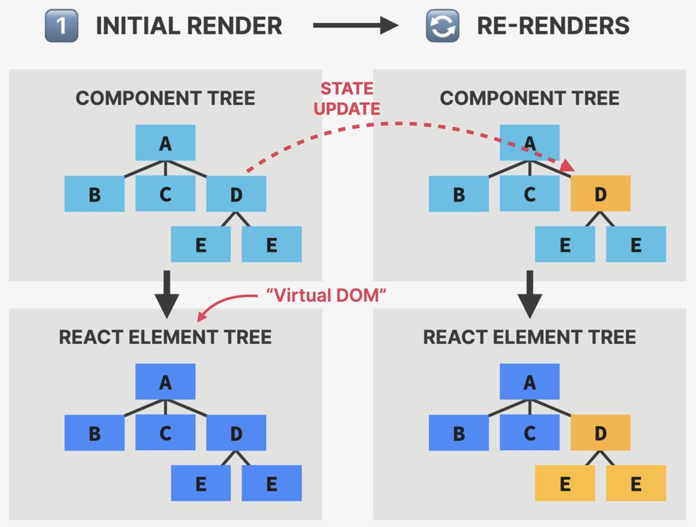
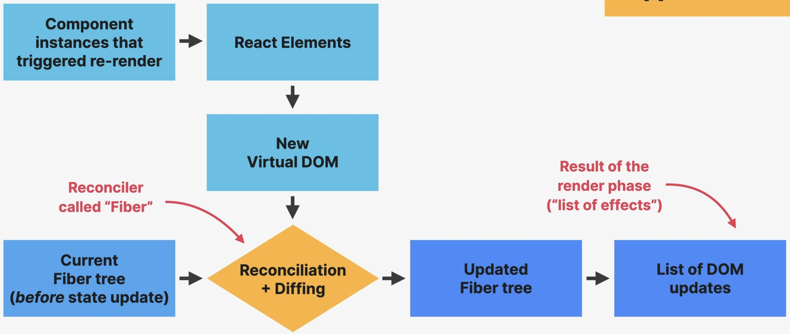
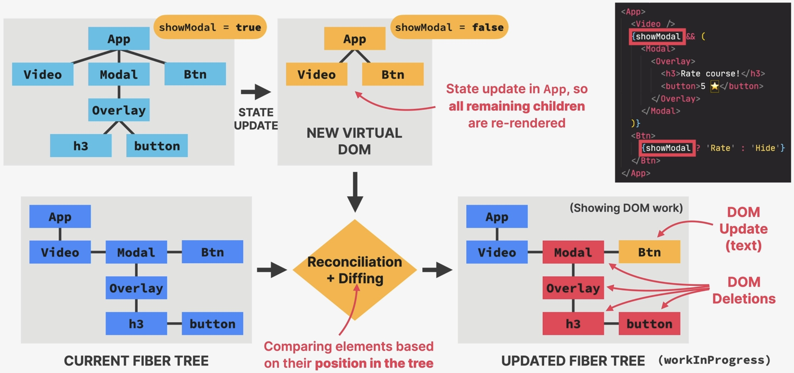

How rendering works
===================
Rendering happens inside React, it is **not** about displaying elements
on the screen, hence does **not** produce visual changes.

    How components are displayed on the screen

Trigger
-------
Two situations trigger a render:

#. **Initial render** of application
#. **State is updated** in one or more component instances (**re-render**)

* The render process is triggered for the **entire application** (not just a single component).
* A render is **not** triggered immediately but **scheduled** when the JS engine has
  some "free time".

Render Phase
------------
Rendering is **not**

    * updating the screen / DOM
    * completely discarding the old view (DOM)

Rendering is

    #. Call component functions, which produce React Elements
    #. These are put into the **virtual DOM**

The virtual DOM is a React Element tree, containing all elements of all instances
in the component tree. Creating a React Element tree is "cheap", as it is "only"
generating a JavaScript object.

.. hint::

    React officially does no longer uses the term *virtual DOM*, but calls it
    React Element Tree.

    The *virtual DOM* has nothing to do with the *shadow DOM*.

On *initial render* the element tree is initially created (by calling each instance's
rendering methods).

On *re-render* the changed element is re-rendered, creating a **new React Element Tree**.
The re-render also applies to **all child components** of the changed element, no
matter if those haven't changed (React doesn't know that).

    Initial Rendering & Re-Render

The new *virtual DOM* is then reconciled using the *React Fiber*, which is a
`reconciler`_ tool. It forms the **Fibre tree** out of the React Element Tree.
On *initial rendering* a initial fibre tree is created. On *re-render* a new
fibre tree is created from the changed React Element Tree and the existing Fibre
tree via *diffing*. This generates an **updated Fibre tree**.

    Render Phase

Why not update the entire DOM whenever a state change happens?

#. writing to the DOM is (relatively) **slow**: cannot write the entire *virtual DOM*
   to the actual DOM on each re-render
#. usually only a **small part of the DOM** needs to be updated (React tries to
   **reuse** as much of the existing DOM as possible)

Reconciliation:

    Deciding which DOM elements actually need to be inserted, deleted or updated,
    in order to reflect the latest changes.

    The *reconciler* is the "heart" of React, allowing us to never touch the
    actual DOM.

Fibre:

    * Creates a *fibre tree* out of the React element tree
    * Fibre tree: internal tree that has a "fibre" for each component instance
      and also DOM elements (like ``h3`` and ``button``)
    * Fibers are **not** re-created on every render (never destroyed)
    * Fibers allow storing *state*, *props*, *side effects*, *hooks*
    * Each fibre contains a *queue of work*, which is filled with tasks during the
      reconciliation, that fibre is supposed to do, like updating state, updating refs,
      running side effect, DOM updates (a fibre therefor is also defined as *unit of work*)
    * Fibre tree relations differ: first child has connection to parents, all other
      children only to the previous sibling --> *linked list* structure (allows
      faster processing)
    * As fibres are *queues of work*, they can be executed **asynchronously** -->
      rendering process can be split into chunks, tasks can be prioritized and
      work can be **paused**, **reused** or **thrown away** (happens behind-the-scenes)
    * asynchronous work allows for **concurrent features** like ``Suspense`` or
      transitions. Also, long renders **won't block** the JS engine

    .. figure:: _file/fiber.jpg

        Fibre

Example:

    Reconciliation in Action

On state change (``showModal = false``):

#. React generates a *new virtual DOM* (re-render)
#. Fibre navigates over the *current fibre tree* and compares it to the *new virtual DOM*
   (diffing) producing a *updated fibre tree* (called ``WorkInProgress``) (reconciliation)

    .. hint::

        *Diffing* is the process of comparing elements based on their position in the tree.

#. All marked-for-change elements are put in a **list of effects** (this will be
   used in the *Commit* phase to mutate the DOM)

.. important::

    The *list of effects* are be consumed by `ReactDOM`_  library in the *Commit* phase.
    Alternatively, it can also be fed to a different **renderers** (though they don't
    render, but commit) for a different *platform* ("hosts"), which is not part of this
    course. An example is `React Native`_ for building iOS and Android apps, `Remotion`_
    to create videos or other renderers for Word, PDF or Figma documents.

    That is why we import both React and ReactDom inside the ``index.js`` file:

    .. code-block:: javascript

        import React, { useState } from "react";
        import ReactDOM from "react-dom/client";

Commit Phase
------------
The *list of effects* is by React to write to the DOM, insert, delete and update
DOM elements (it "flushes" to the DOM).

.. important::

    This phase is executed by the `ReactDOM`_ library, not React itself (which never
    touches the DOM).

**Commit is synchronous**: DOM is updated in one go, can't be interrupted. Necessary
to not show partial results, ensuring consistency of the UI -> it's the main reason
why *rendering* and *commit* are separate phases.

After commit phase completes, the ``workInProgress`` fibre tree becomes the ``current``
tree **for the next cycle**.

Browser Paint
-------------
The browser notices DOM changes and repaints the screen. Is done entirely by the
browser.

.. _reconciler: https://www.geeksforgeeks.org/reactjs/reactjs-reconciliation/
.. _ReactDOM: https://react.dev/reference/react-dom
.. _React Native: https://reactnative.dev/
.. _Remotion: https://www.remotion.dev/