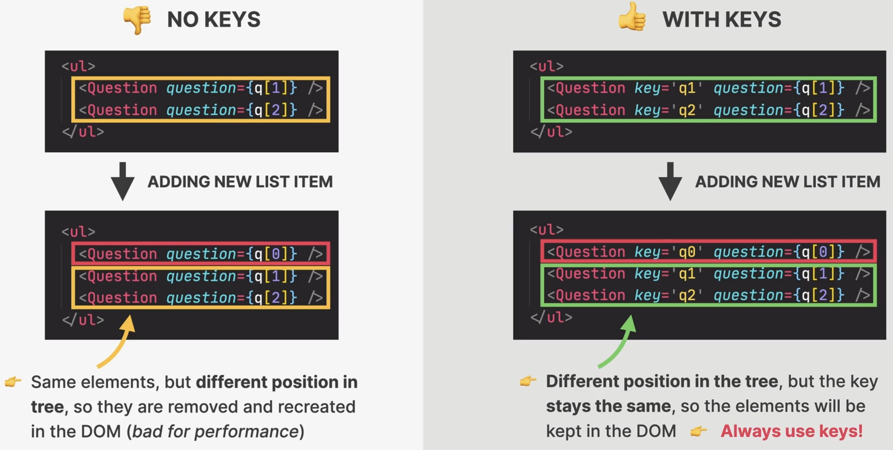
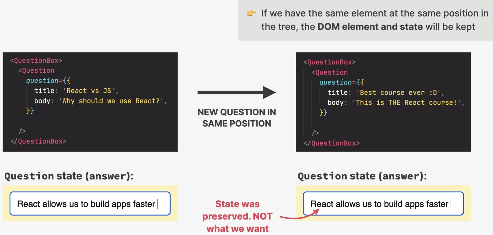
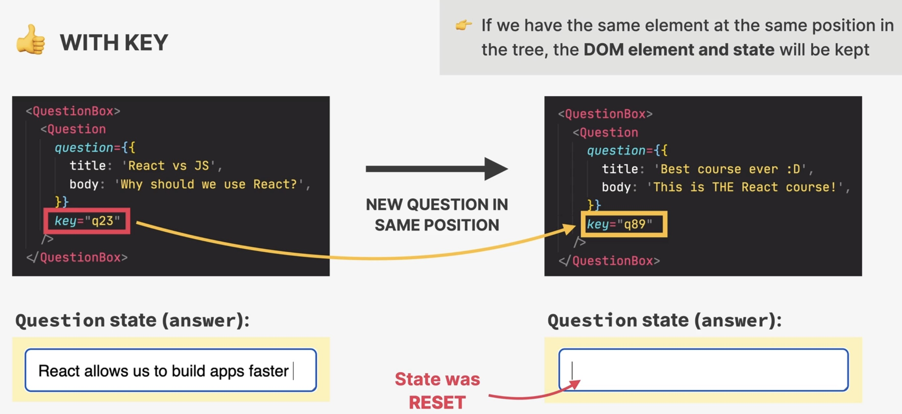

How diffing works
=================
Two fundamental assumptions (rules):

#. Two element of different types with **produce different trees**
#. Elements with a stable ``key`` prop **stay the same across renders**

Only **two situations**:

#. Same position, **different** element

    * React assumes, the **sub-tree** of the different element to be **no longer valid**
    * Old components are destroyed and removed from DOM, **including state**
    * Rebuilding a tree, resets all state of the children

    .. figure:: _file/same_position_different_element.jpg

        Same position, different element

#. Same position, **same** element

    * element will be kept (as well as child elements), **including state**
    * **new props / attributes** are passed if they changed between renders
    * Sometimes this is **not** what we want -> then we can use the ``key`` prop

    .. figure:: _file/same_position_same_element.jpg

        Same position, same element

The key prop
============
* Special prop to tell the algorithm that an element is **unique**
* Works for both React and DOM elements
* Allows React to **distinguish** between multiple instances of the same component type
* When a key **stays the same across renders**, the element will be kept in the DOM
  (even if the position in the tree changes)

    1. using keys in lists

* When a key **changes between renders**, the element will be destroyed and a new
  one will be created (even if the position in the tree is the same as before)

    2. Using keys to reset state

1. Keys in lists (stable key)
-----------------------------

    Setting ``key`` will not re-create non-changing list elements

2. Using keys to reset state (changing key)
-------------------------------------------
Elements don't change their position, but still require to update their state:

    Without ``key``, the state will not change (as element is kept as is)

    By updating the elements ``key``, it is re-rendered, state is reset
