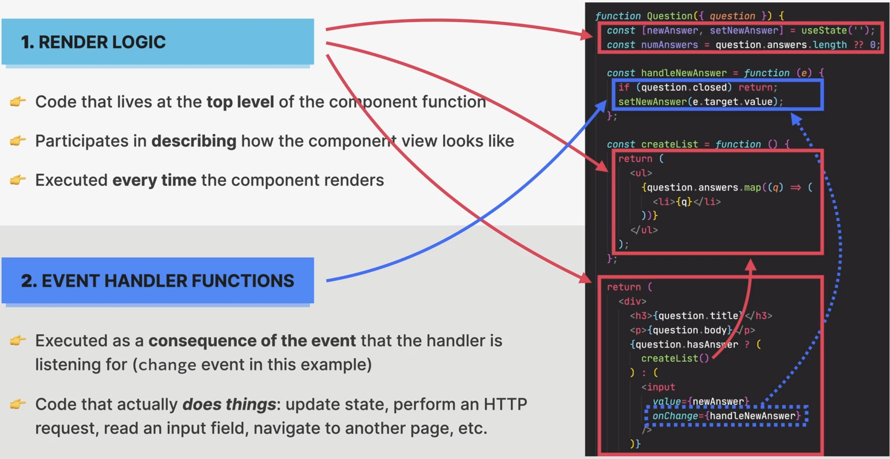

Rules for Render Logic: Pure Components
=======================================
Two types of logic in React components:

#. Render logic

    * Code that lives at the **top level** of the component function
    * Participates in **describing** how the component view looks like

#. Event handler function

    * Executed as a **consequence of the event** that the handler is listening for
      (``change`` event for example below)
    * code that actually **does things**: update state, perform an HTTP request,
      read an input field, navigate to another page etc.

    Two types of logic in React components

**Functional programming principles**

Side effect:

    Dependency on or modification of any data outside the function scope.
    Examples: mutating external variables, HTTP requests, writing to DOM

    .. hint::

        **Side effects are not bad!** A program can only be useful if it has some
        interaction with the outside world.

Pure functions:

    * A function that has **no** side effects (don't change any variable outside
      of their scope)
    * Given the **same input**, a pure function always returns the **same output**

**Rules for render logic**

* **Components must be pure when it comes to render logic**: given the same props
  (input), a component instance should always return the same JSX (output)
* **Render logic must produce no side effect**: no interaction with the "outside world"
  is allowed:

    * Do NOT perform **network requests** (API calls)
    * Do NOT start timers
    * Do NOT directly **use the DOM API** (e.g. register event listeners)
    * Do NOT **mutate objects or variables** outside of the function scope
      --> this is why we can't mutate props! (hard rule of React)
    * Do NOT **update state (or refs)**: this will create an infinite loop!

.. important::

    Side effects are allowed (and encouraged) in **event handler functions!**
    There is also a special hook to **register side effects** (``useEffect``).
