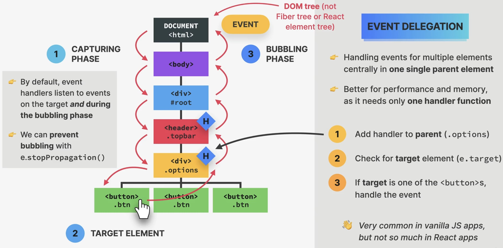
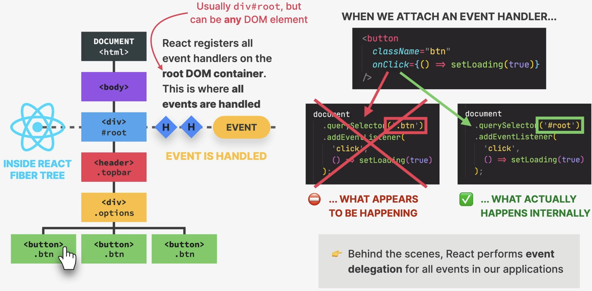

How Events Works in React
=========================
Event propagation and delegation
--------------------------------
Also see :ref:`tutorial_javascript_alfatraining_events`.

    Event Propagation and Delegation

* In the browser DOM, an event is created at the **root** (the ``document`` element),
  not at the element, which triggered the event
* It then travels down to the target element (*Capturing Phase*)
* At the target element, we choose to handle the event by providing an event handler
  function on the element
* Once the event arrives at the target element, it travels back to the *root element*
  (*Bubbling Phase*)
* By default, event handlers listen to events on target **and during the bubbling phase**,
  which means, every element the event travels through during the bubbling phase could
  potentially also handle that event (if the handler matches the event type)
* we can **prevent bubbling** via ``e.stopPropagation()`` (on the event object),
  though this is rarely desired --> can also be done in React

Event delegation

    * allows for handling events of multiple elements centrally in **one single parent element**
    * better performance and memory, as it needs only **one handler function** (if we had
      1000 buttons, all handling the same event, all of them needed a copy of the event
      handler function) **in the first common parent element**:

        #. Add handler to **parent**
        #. Check for **target** element (does it come from a child?)
        #. If target is a child element, handle the event

    .. hint::

        React already does *event delegation* behind the scenes with our events.

How React handles events
------------------------
React registers all event handlers **on the root DOM container** (where ``App`` lives).
This is where **all events are handled**. React bundles all events of the same type
as one collection and registers it on the **root node of the Fiber tree**, hence all
events are delegated to the root container.

.. important::

    What matters here is the DOM tree, not the React component tree. For example,
    a child component might not necessarily be a direct child element in the DOM tree.

    How React handles events

Synthetic events
----------------

.. code-block:: jsx

    <input onChange={(e) => setText(e.target.value)} />

* React passes the **event object** into the handler function by default (just like
  in vanilla JavaScript), but it differs from JavaScript
* In JavaScript though, we get access to the native DOM event object, for example
  ``PointerEvent``, ``MouseEvent``, ``KeyboardEvent``
* React gives us a **SyntheticEvent**, a thin wrapper around the DOM's native event object
  adding and changing some functionality
* Has the **same interface** as native event objects, like ``stopPropagation()`` and
  ``preventDefault()``
* Fixes browser inconsistencies so that events works in the exact **same way in all browsers**
* **Most synthetic events bubble** (including focus, blur and change) except for scroll

Event handler in React compared to JS

* Attributes for event handlers are named using **camelCase**, e.g. ``onClick`` instead of
  ``onclick`` (event handler) or ``click`` (event listener)
* Browser default behaviour can **not** be prevented by returning ``false`` (only by
  using ``preventDefault()``)
* Attach ``Capture`` to the event handler if you need to handle during **capture phase**
  e.g. ``onClickCapture``
