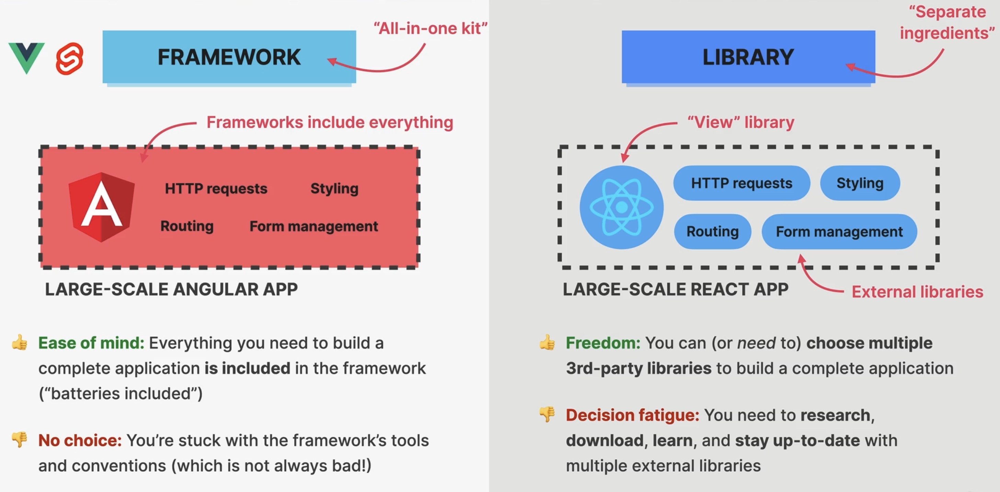
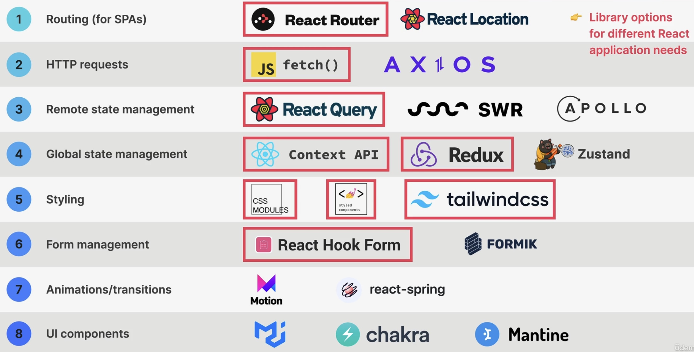
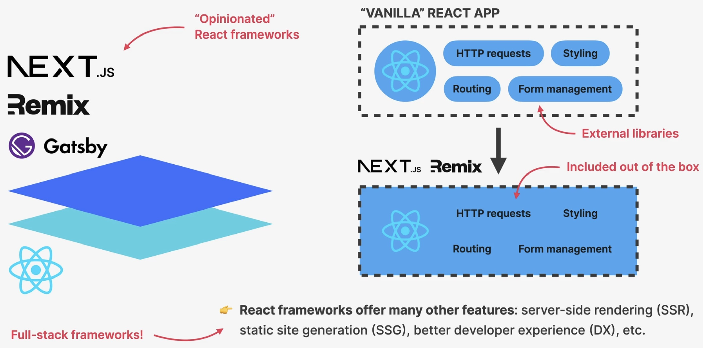

Framework vs. Library
=====================
React is not a framework, but a library.

    Framework vs. Library

React has a large library ecosystem (circled red ones are considered the most
important ones):

    React 3rd-party library ecosystem

The amount of choices lead to the development of **React frameworks**, which already
do the necessary selection of these tools (therefor "opinionated"). Such frameworks include:

* `Next.js`_
* `Remix`_
* `Gatsby`_

    React Libraries

Some frameworks are even considered **full stack frameworks**, as they offer other
features.

.. _Next.js: https://nextjs.org/
.. _Remix: https://remix.run/
.. _Gatsby: https://www.gatsbyjs.com/