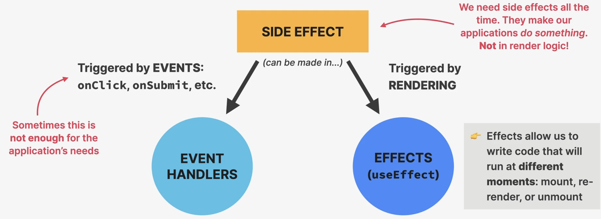
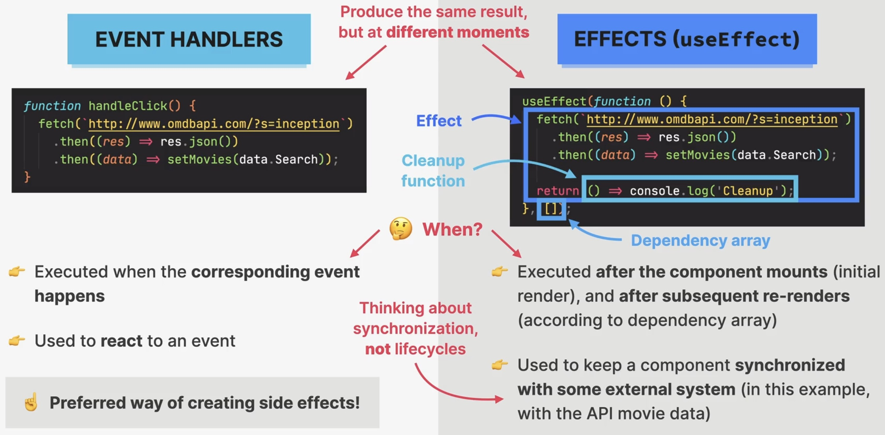

How NOT to fetch data
=====================
As said before, no code which causes changes to the "outside world", hence create
side-effects, should happen inside *render logic*.

If you do this:

.. code-block:: jsx

    const KEY = "38602acf";

    export default function App() {
      const [movies, setMovies] = useState([]);

      fetch(`http://www.omdbapi.com/?apikey=${KEY}&s=goldeneye`)
        .then((res) => res.json())
        .then((data) => setMovies(data.Search));

      return (
        {*/ render logic here */}
      )

    }

The data fetch is repeated endlessly, as the fetch updates state, re-runs fetch,
updates state, and so on --> **DON'T DO THIS**

useEffect to the Rescue
=======================

.. code-block:: jsx
    :emphasize-lines: 1,8-12

    import { useEffect, useState } from "react";

    const KEY = "38602acf";

    export default function App() {
      const [movies, setMovies] = useState([]);

      useEffect(function () {
        fetch(`http://www.omdbapi.com/?apikey=${KEY}&s=goldeneye`)
          .then((res) => res.json())
          .then((data) => setMovies(data.Search));
      }, []);

      return (
        {*/ render logic here */}
      )

    }

The ``useEffect(setup, dependencies?)`` hook requires a function to be passed in
as ``setup`` and an array of ``dependencies`` (here: empty array, which means this
function is only executed on mount / initial render).

.. important::

    Passing an empty array as the second argument in ``useEffect`` causes that
    function to **only run on mount / initial rendering** of the component.

In larger, more complex applications, a different tool may be used to fetch data.

A first look at effects
=======================
.. hint::

    A **side effect** is basically any "interaction between a React component and the
    world outside the component". We can also think of a side as "code that actually
    does something". Examples: Data fetching, setting up subscriptions, setting up
    timers, manually accessing the DOM, etc.

    Where to create side effects

The moment when a **effect** is executed depends on its **dependencies array**.

    Event handlers vs. effects

Event handlers are the **preferred way** to create side-effects (only use effects,
if functionality cannot be done with event handlers).