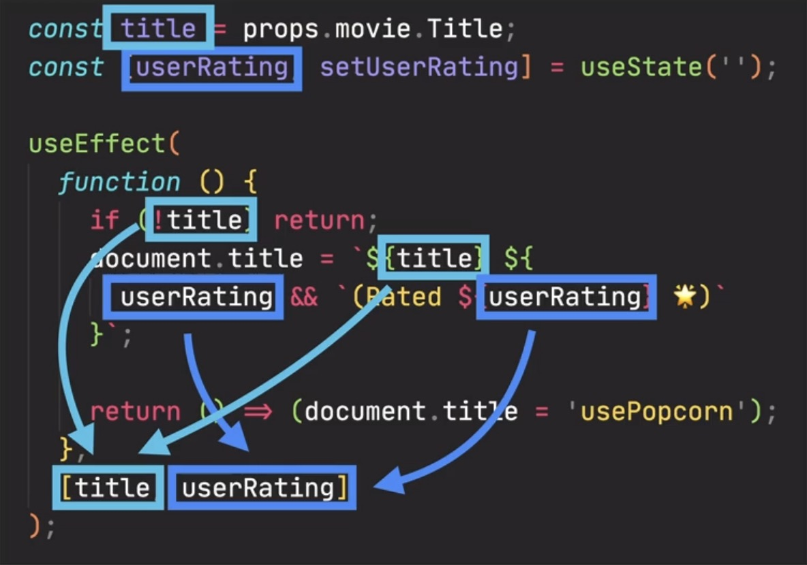
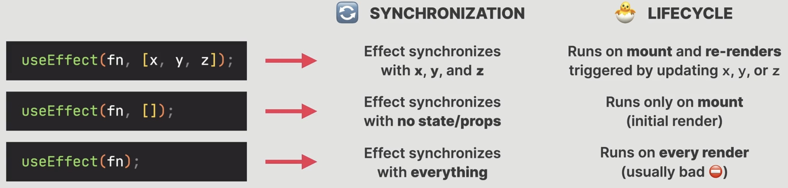
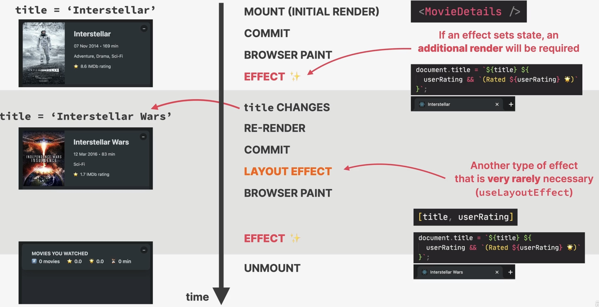

The useEffect Dependency Array
==============================
* by default, effects run **after each render** of the enclosing component
* we prevent that by passing in a **dependency array**
* without the dependency array React does not know when to run the effect
* an effect is then run **each time any of the dependencies changes**
* every **state variable** and **prop** used inside the effect **MUST** be included
  in the dependency array
* the reason is that, if the effect function changes any state variable or prop,
  React otherwise does not know

    * about if their values changed (stale closure)
    * when to re-run the effect

    Example of an effect with a non-empty dependency array

* Effects **react** to updates to state and props used inside the effect (the
  dependencies). So **effects** are "reactive" (like state updates re-rendering the UI)
* ``useEffect`` is a synchronization mechanism to sync effects with the state of
  the application

.. important::

    Variables inside the dependency array must be **state variables** or **props**.

* we can use a dependency array to run effects **when the component renders or re-renders**

Three different types of dependency arrays:

    Dependency Array Types

When are effects executed? **After** the paint to the browser completed

.. important::

    If multiple effects are executed upon the same event, e.g. changing a state variable
    that all those effects synchronize on, they are executed **in the order of declaration**
    in the code (top to bottom).

We say, that effects execute *asynchronous* after the render has been painted.
The reason is, that effects may contain long running processes (such as fetching data)

.. hint::

    If an effect sets state, an **additional render** will be required. That's why
    we should limit the amount of effects.

    Example on ``title`` (which is a prop)

.. important::

    A **layout effect** runs **before** the browser paints to the screen. React
    officially discourages to use that effect.
