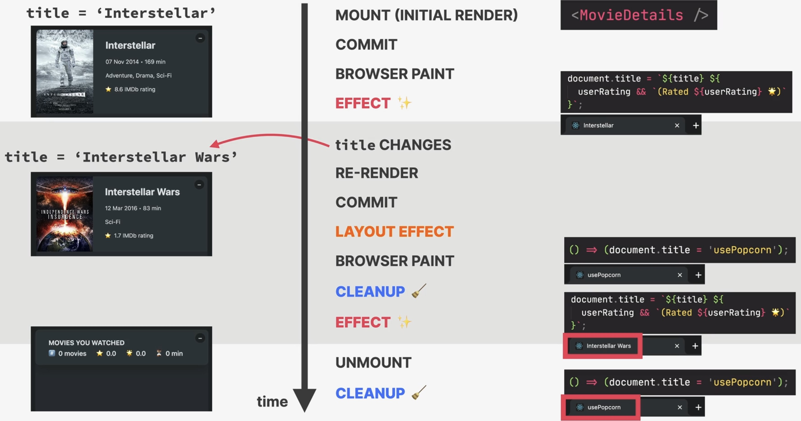

.. _tutorial_react_ultimate_useeffect_cleanup_function:

The useEffect Cleanup Function
==============================
* We want the changes of an effect to be **reverted** when the component which contains
  that effect is **unmounted**.
* We can do that with a **cleanup function**, which executes when the component unmounts
* the cleanup function **also runs on re-renders**

* the cleanup function can **return from an effect** (optional)
* runs:

    #. before the effect is **executed again** (re-renders)
    #. after the component has **unmounted**

* necessary whenever the side effect **keeps happening after the component has**
  **been re-rendered or unmounted**

    Example: A side effect makes an HTTP request. The component is re-rendered before
    the request is completed, triggering yet another HTTP request, which may lead
    to a race condition.

    A potential cleanup would be to cancel the previous request.

    .. figure:: _file/example_cleanup.jpg

        Example cleanups for certain conditions

.. important::

    Each effect should do **one thing**. Use **one useEffect hoch for each side effect**.
    This make effects easier to clean up.

Example: Reset document title
-----------------------------
As said, a cleanup method is a function, that is returned by the side effect function:

.. code-block:: jsx
    :emphasize-lines: 6-8

      useEffect(
        function () {
          if (!title) return;
          document.title = `Movie | ${title}`;

          return function () {
            document.title = "usePopcorn";
          };
        },
        [title]
      );

.. important::

    **Closures in JavaScript**

    The cleanup function runs **after** the component has been unmounted. Though, the
    function is a **closure**, which means, in JavaScript a function remembers the value
    of ``title`` even after the ``MovieDetails`` function has been unmounted.

Cleaning up fetching data
=========================
**Problem**

As of now, at each keystroke, an HTTP request is sent:

* the ``App`` component defines the effect to do an HTTP request, if the ``query``
  changes

.. code-block:: jsx
    :emphasize-lines: 9-11, 34

      const [query, setQuery] = useState("");

      useEffect(
        function () {
          async function fetchMovies() {
            try {
              setIsLoading(true);
              setError("");
              const res = await fetch(
                `http://www.omdbapi.com/?apikey=${KEY}&s=${query}`
              );
              if (!res.ok) {
                throw new Error("Something went wrong with fetching movies");
              }

              const data = await res.json();
              if (data.Response === "False") {
                throw new Error("No matching movies found");
              }
              setMovies(data.Search);
            } catch (err) {
              setError(err.message);
            } finally {
              setIsLoading(false);
            }
          }
          if (query.length < 3) {
            setMovies([]);
            setError("");
            return;
          }
          fetchMovies();
        },
        [query]
      );

* the ``Search`` component contains a query input field, which sets the ``query``
  at every keystroke:

.. code-block:: jsx
    :emphasize-lines: 8

    function Search({ query, setQuery }) {
      return (
        <input
          className="search"
          type="text"
          placeholder="Search movies..."
          value={query}
          onChange={(e) => setQuery(e.target.value)}
        />
      );
    }

That way, we download too much data, data received before the query is finished,
is not used.

Moreover, if an intermediate request finishes last, it would overwrite the results
of the last started request (which contains the data we want).

**Solution**

Stop previous HTTP request when starting the new one by using an
browser native abort controller in the cleanup function:

* define a AbortController instance ``controller``
* pass in ``controller`` as the ``signal`` property of the request
* define a function which calls the ``controller.abort()`` method as the effect's
  return function (cleanup function)

.. code-block:: jsx
    :emphasize-lines: 3,10,34-36

      useEffect(
        function () {
          const controller = new AbortController();
          async function fetchMovies() {
            try {
              setIsLoading(true);
              setError("");
              const res = await fetch(
                `http://www.omdbapi.com/?apikey=${KEY}&s=${query}`,
                { signal: controller.signal }
              );
              if (!res.ok) {
                throw new Error("Something went wrong with fetching movies");
              }

              const data = await res.json();
              if (data.Response === "False") {
                throw new Error("No matching movies found");
              }
              setMovies(data.Search);
            } catch (err) {
              setError(err.message);
            } finally {
              setIsLoading(false);
            }
          }
          if (query.length < 3) {
            setMovies([]);
            setError("");
            return;
          }
          fetchMovies();

          return function () {
            controller.abort();
          };
        },
        [query]
      );

.. important::

    When making fetch-requests inside an effect which may lead to **many requests**
    **within a short period of time**, **always** define a cleanup function which
    removes the previous request (if still ongoing).
