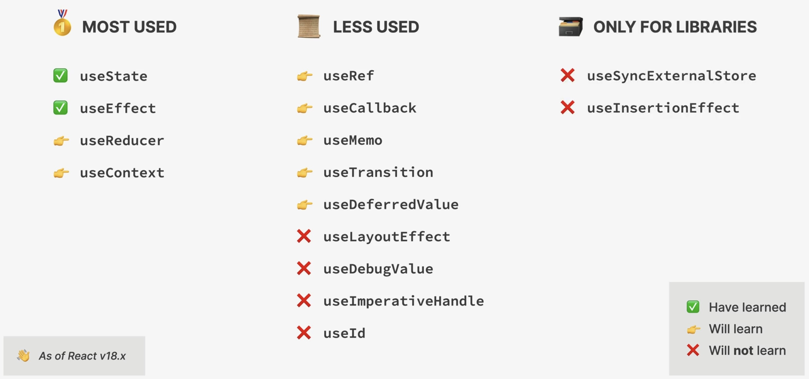

.. _tutorial_react_ultimate_hooks_and_rules:

React Hooks and their rules
===========================
What are React hooks?

* special built-in functions that allows us to **"hook" into React internals**
  (in other words, APIs which expose certain internal React functionality), such as:

    * creating and accessing **state** from the Fiber tree
    * registering **side effects** in the Fiber tree
    * Manual **DOM selections**
    * Many more ...

    .. hint::

        The Fiber tree is not accessible directly, only via hooks like ``useState``
        or ``useEffect``.

* all hooks start with ``use`` (``useState``, ``useEffect``, etc.)
* enable easy **reusing of non-visual logic** (not for the UI) : we can compose
  multiple hooks into our own **custom hook**
* give **function components** the ability to own state and run side effects at
  different lifecycle points (before v16.8 only available in **class components**)

All built-in hooks:

    React Hooks overview

**Rules of hooks**

#. **Hooks can only be called at the top level:**

    * Do **NOT** call hooks inside
      **conditionals, loops, nested functions** or after an **early return**

    * This is necessary to ensure that hooks are called in the **same order**
      (hooks rely on this) -> this can only be ensured at the top level (e.g.
      not inside if-statements or early returns)

#. **Hooks can only be called from React function:**

    * Only call hooks inside a **function component** or a **custom hook** (but
      not from regular functions or class components)

.. hint::

    Both rules are automatically enforced by React's ESLint rules.

.. hint::

    **Hooks rely on call order**

    A component's fiber (inside the fiber tree) also contains a **list of hooks**,
    which is a *linked list*, meaning that each hook contains a reference to the
    next hook of the list.

    If a certain hook is not called, the linked list becomes broken. React cannot
    recover from that.

    Why use a linked list? Easiest way to identify the order number of each hook.
    The *value* of a state is associate by its position, so by that
    **hooks don't require names**.

    -> order of hooks **must not** change from one render to the next
