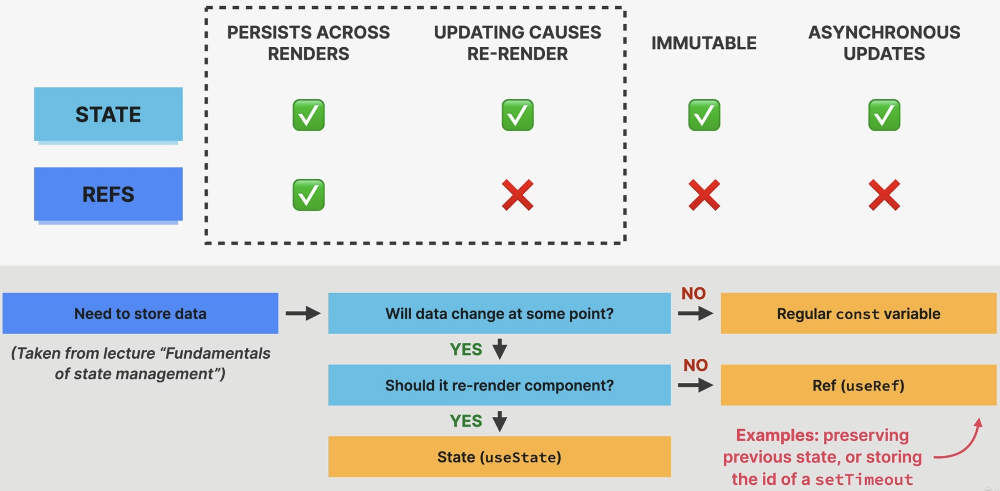

How NOT to select a DOM elements in React
=========================================
**Task**: Focus the *Search* field at application start (initial render).

We could do that via a effect handler function within the respective component:

.. code-block:: jsx
    :emphasize-lines: 2-6

    function Search({ query, setQuery }) {
      useEffect(function () {
        const element = document.querySelector(".search");
        console.log(element);
        element.focus();
      }, []);
      return (
        <input
          className="search"
          type="text"
          placeholder="Search movies..."
          value={query}
          onChange={(e) => setQuery(e.target.value)}
        />
      );
    }

This is **not a good practice** as React is all about using a **declarative** style,
not imperatively manually manipulating the DOM by selecting an element (same as
we don't manually add event listeners to elements).

Introducing another hook: useRef
================================
What are refs?

* It is a "Box" with a **mutable** ``.current`` property, which
  **persists across renders** ("normal" variables are always reset), just like state.

* Any data can be written and read from ``.current``. Unlike any other variable in React,
  it is mutable.

* Two big use cases:

    #. Create variables that stay the same between renders (e.g. previous state,
       ``setTimeout`` id, etc)
    #. Select and store DOM elements

* Refs are for **data that is NOT rendered**: usually only appear in event handlers
  or effects, not in JSX (otherwise use state). We can use them in JSX, but that is
  not intended -> use state instead.

* Do **NOT** read or write ``.current`` property in render logic (same as with state,
  as this would cause side-effects). Mutations are usually performed in ``useState``
  setter functions.

    State vs. Ref

* refs update synchronously, hence updated values can be used immediately

.. hint::

    State variables are considered as immutable, because its setter function only
    changes the reference, that the state variable points to, not replacing the
    state variable's value:

    .. code-block:: jsx

        user.name = "Arne"; // ❌ mutation — same reference
        setUser(user);      // React sees: same reference → no change → no re-render

Select DOM elements via Ref
===========================

.. important::

    Not the Ref object itself (e.g. ``inputElement`` below) references the DOM element,
    but its ``.current`` property (e.g. ``inputElement.current``).

Three steps:

#. Create ref using ``useRef``:

    .. code-block:: jsx

        const inputElement = useRef(null);

    * for DOM elements we usually use ``null`` as default

#. Pass the Ref object into the element in your JSX:

    .. code-block:: jsx
        :emphasize-lines: 8

          return (
            <input
              className="search"
              type="text"
              placeholder="Search movies..."
              value={query}
              onChange={(e) => setQuery(e.target.value)}
              ref={inputElement}
            />
          );

#. Reference the Ref object's ``current``, which now holds the reference to the
   DOM element, inside non-render logic (e.g. inside ``useEffect``):

    .. code-block:: jsx

          useEffect(function () {
            inputElement.current.focus();
          }, []);

**Another task**: Focus DOM element when hitting "Enter" key

.. important::

    When referencing the ``document`` DOM element, we **cannot** use a Ref.

Here, again using an effect to focus on the Search input element. As we also want
to unregister the event handler, once the page paint completed due to hitting the
"Enter" key, we use a ``callback`` function when adding the event listener and again
in the cleanup function when calling ``document.removeEventListener()`` to remove
that same event listener:

.. code-block:: jsx

      const inputElement = useRef(null);

      useEffect(
        function () {
          function callback(e) {
            if (e.code === "Enter") {
              inputElement.current.focus();
              setQuery("");
            }
          }
          document.addEventListener("keydown", callback);
          return () => document.removeEventListener("keydown", callback);
        },
        [setQuery]
      );
