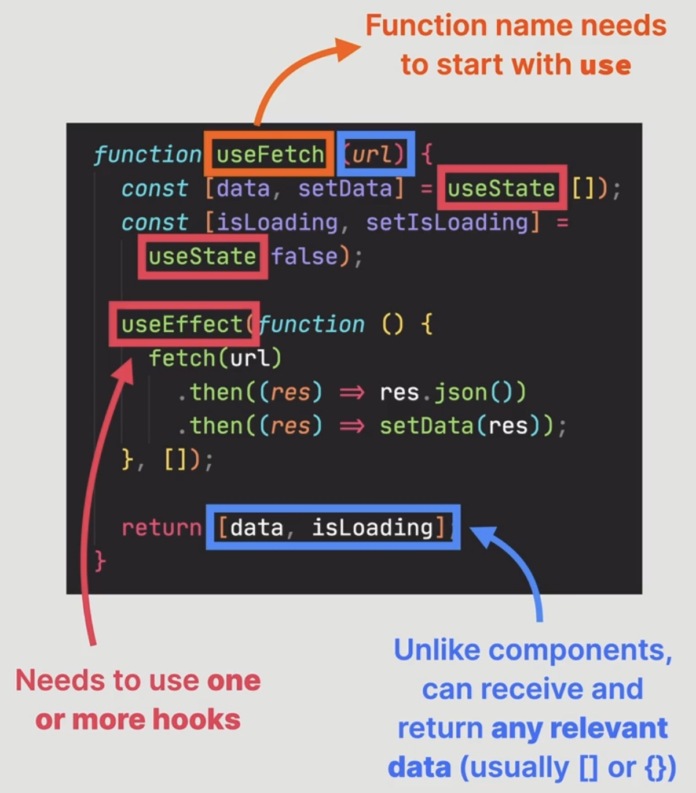

What are custom hooks? When to create one?
==========================================
In React we have **two things** we want to reuse:

    * UI --> Component
    * Logic:

        * without hooks --> use regular function
        * with hooks --> create custom hook

* Allows us to reuse **non-visual logic** in multiple components, that contain hooks
* One custom hook should have **one purpose**, to make it **reusable** and **portable**
  (even across multiple projects)
* :ref:`Rules of hooks <tutorial_react_ultimate_hooks_and_rules>` apply to custom hooks too

    .. hint::

        Custom hooks are shared by other developers via npm packages.

Example:

* a hook is a function
* it receives and returns any relevant data (usually ``[]`` or ``{}``)
  (as opposed to components, which can only receive props and must return JSX)
* need to use **one or more hooks**
* function name must start with ``use`` (React demands this)

    .. hint::

        Custom hooks can be used in multiple projects.

Create first custom hook: useMovies
-----------------------------------
#. create function in separate file
#. may use named export (without ``default``) for hook function
#. move out ``useEffect()`` function for fetching movies from API into hook function
#. move required state variables into hook file (top of hook function)
#. pass missing state variables (query) as argument (those are **not props**)
#.    trial call of ``useMovies(query)`` (auto import in VS code)
#. make custom hook return missing variables (here: ``movies``, ``isLoading``, ``error``)
   as object (also as array is possible) and accept in custom hook call:

    .. code-block:: jsx
        :emphasize-lines: 4

        export default function App() {
          const [query, setQuery] = useState("");
          const [selectedId, setSelectedId] = useState(null);
          const { movies, isLoading, error } = useMovies(query);

          {/* more stuff */}

        }

#. missing ``handleCloseMovie()`` method: pass in callback function, which the
   hooks calls (move it to beginning of custom hook function):

    .. code-block:: jsx
        :emphasize-lines: 1,8

        export function useMovies(query, callback) {
          const [movies, setMovies] = useState([]);
          const [isLoading, setIsLoading] = useState(false);
          const [error, setError] = useState("");

          useEffect(
            function () {
              callback?.();

              {/* more stuff */}
          )};
        }

    only calling, if ``callback`` is passed.

    and inside ``App.js`` call custom hook receiving its returned object values:

    .. code-block:: jsx
        :emphasize-lines: 4

        export default function App() {
          const [query, setQuery] = useState("");
          const [selectedId, setSelectedId] = useState(null);
          const { movies, isLoading, error } = useMovies(query, handleCloseMovie);

          {/* more stuff */}

        }

    .. important::

        Adding ``callback`` to our dependency array of the ``useEffect`` hook inside
        ``useMovies`` triggers an infinity re-render. Let's remove ``callback`` for now.
        We'll fix it later.

    .. todo: Link to section, where above issue is fixed.

    .. hint::

        As function declarations are hoisted, they can be called higher inside the
        file as their declaration, here ``function handleCloseMovie()``.

        Recommendation: ** Always use function declarations for callback function**.

Create useLocalStorageState
---------------------------
We want to put a state variable (``useState`` call) which reads and saves data
to local storage, into its own custom hook (``useLocalStorageState``).

#. Copy code for reading ``watched`` state variable into local storage into new file
   ``useLocalStorageState.js``:

    .. code-block:: jsx

        import { useState } from "react";

        export function useLocalStorageState(initialState) {
          const [watched, setWatched] = useState(function () {
            const storedValue = JSON.parse(localStorage.getItem("watched"));
            return storedValue;
          });
        }

#. Make names more generic:

    .. code-block:: jsx
        :emphasize-lines: 4

        import { useState } from "react";

        export function useLocalStorageState(initialState) {
          const [value, setValue] = useState(function () {
            const storedValue = JSON.parse(localStorage.getItem("watched"));
            return storedValue;
          });
        }

#. Also add code from ``App`` for saving data to local storage and fix name, imports:

    .. code-block:: jsx
        :emphasize-lines: 1,9-14

        import { useState, useEffect } from "react";

        export function useLocalStorageState(initialState) {
          const [value, setValue] = useState(function () {
            const storedValue = JSON.parse(localStorage.getItem("watched"));
            return storedValue;
          });

          useEffect(
            function () {
              localStorage.setItem("watched", JSON.stringify(value));
            },
            [value]
          );
        }

    .. hint::

        ``useEffect()`` can be defined inside custom hooks.

#. Adapt hardcoded localStorage ``key`` to another argument value:

    .. code-block:: jsx
        :emphasize-lines: 3,5,11,13

        import { useState, useEffect } from "react";

        export function useLocalStorageState(initialState, key) {
          const [value, setValue] = useState(function () {
            const storedValue = JSON.parse(localStorage.getItem(key));
            return storedValue;
          });

          useEffect(
            function () {
              localStorage.setItem(key, JSON.stringify(value));
            },
            [value, key]
          );
        }

#. Set a return value (here, return ``value`` state variable and its setter, allows
   for consumers of the custom hook to pass it any state variable):

    .. code-block:: jsx
        :emphasize-lines: 16

        import { useState, useEffect } from "react";

        export function useLocalStorageState(initialState, key) {
          const [value, setValue] = useState(function () {
            const storedValue = JSON.parse(localStorage.getItem(key));
            return storedValue;
          });

          useEffect(
            function () {
              localStorage.setItem(key, JSON.stringify(value));
            },
            [value, key]
          );

          return [value, setValue];
        }

#. Fix problem: return initial state, if no data for key in local storage:

    .. code-block:: jsx
        :emphasize-lines: 6

        import { useState, useEffect } from "react";

        export function useLocalStorageState(initialState, key) {
          const [value, setValue] = useState(function () {
            const storedValue = localStorage.getItem(key);
            return storedValue ? JSON.parse(storedValue) : initialState;
          });

          useEffect(
            function () {
              localStorage.setItem(key, JSON.stringify(value));
            },
            [value, key]
          );

          return [value, setValue];
        }

#. Call the ``useLocalStorageState()`` function from ``App``:

    .. code-block:: jsx
        :emphasize-lines: 5

        export default function App() {
          const [query, setQuery] = useState("");
          const [selectedId, setSelectedId] = useState(null);
          const { movies, isLoading, error } = useMovies(query);
          const [watched, setWatched] = useLocalStorageState([], "watched");

          {/* more stuff */}

        }

.. hint::

    The new ``setWatched`` function not only updates the state, but also writes
    the data to the local storage.

Create useKey
-------------
Moving an event handler for closing the movie details when pressing *Escape* key.
As it uses a ``useEffect`` hook, it can be moved into a separate custom hook.

#. Move effect code into separate function ``useKey()``:

    .. code-block:: jsx

        import { useEffect } from "react";

        export function useKey() {
          useEffect(
            function () {
              function callback(e) {
                if (e.code === "Escape") {
                  onCloseMovie();
                  console.log("Closing");
                }
              }
              document.addEventListener("keydown", callback);
              return function () {
                document.removeEventListener("keydown", callback);
              };
            },
            [onCloseMovie]
          );
        }

#. Add arguments: ``key`` on which to react and ``action`` on which function to run:

    .. code-block:: jsx
        :emphasize-lines: 3,7-8,17

        import { useEffect } from "react";

        export function useKey(key, action) {
          useEffect(
            function () {
              function callback(e) {
                if (e.code.toLowerCase() === key.toLowerCase()) {
                  action();
                  console.log("Closing");
                }
              }
              document.addEventListener("keydown", callback);
              return function () {
                document.removeEventListener("keydown", callback);
              };
            },
            [key, action]
          );
        }

    .. hint:: The ``toLowerCase()`` calls ensure that various key formats are handled correctly.

#. Call ``useKey`` from ``MovieDetails``:

    .. code-block:: jsx

        import { useKey } from "./useKey";

        function MovieDetails({ selectedId, onCloseMovie, onAddWatched, watched }) {

          {/* more stuff */}

          useKey("Escape", onCloseMovie);

          {/* more stuff */}

        }

#. Reuse ``useKey`` inside the ``Search`` component to focus search field when
   hitting "Enter":

    .. code-block:: jsx

        function Search({ query, setQuery }) {

          {/* more stuff */}

          useKey("Enter", function () {
            if (document.activeElement === inputElement.current) return;
            inputElement.current.focus();
            setQuery("");
          });

          {/* more stuff */}
        }

    .. hint::

        Instead of passing a function reference, we define the function right as
        the custom hook's call ``action`` argument.

        As ``action`` argument we pass in a function declaration which does everything,
        that the ``useEffect`` function does inside its ``callback`` function minus
        the check of the appropriate button (*Enter*) - this is already taken care
        of our ``useKey`` function:

        .. code-block:: jsx
            :emphasize-lines: 4-10

              useEffect(
                function () {
                  function callback(e) {
                    if (document.activeElement === inputElement.current) {
                      return;
                    }
                    if (e.code === "Enter") {
                      inputElement.current.focus();
                      setQuery("");
                    }
                  }
                  document.addEventListener("keydown", callback);
                  return () => document.removeEventListener("keydown", callback);
                },
                [setQuery]
              );

        The event listeners are also added and removed in ``useKey()`` hook.
