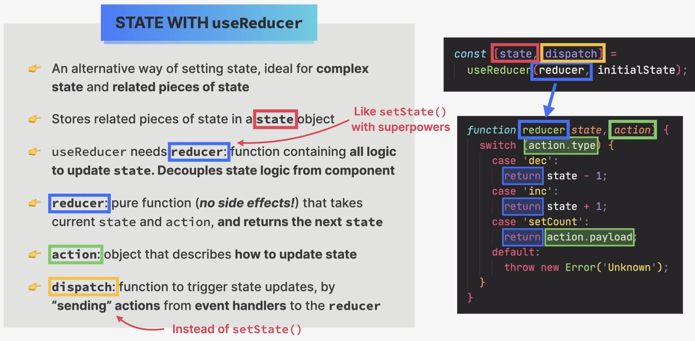
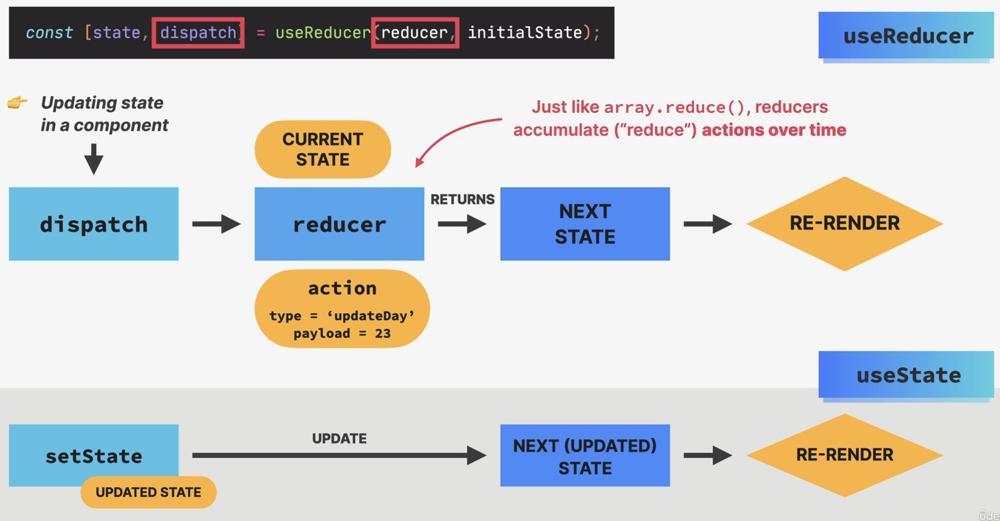
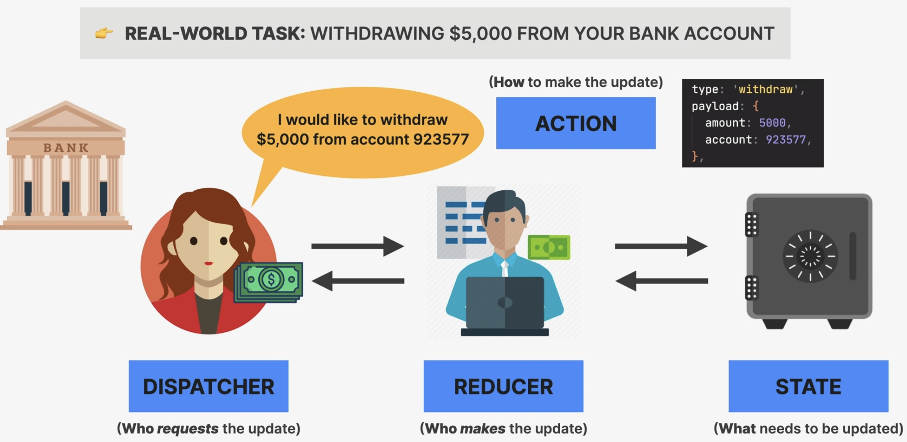

Managing State with useReducer
==============================
**Why** ``useReducer`` **?**

State management with ``useState`` is not enough in certain situations:

#. When components have **a lot of state variables and state updates**, spread
   across many event handlers **all over the component**
#. When **multiple state updates** need to happen **at the same time** (as a reaction
   to the same event, like "starting a game")
#. When updating one piece of state **depends on one or multiple other pieces of state**

**State with** ``useReducer``

* alternative way to setting state, ideal for **complex state** and **related pieces of state**
* stores related pieces of state in a **state** object:

    .. code-block:: jsx

        const [state, dispatch] = useReducer(reducer, initialState);

* ``useReducer`` needs a ``reducer`` function containing **all logic to update** ``state``.
  It **decouples state logic from the component**, making the component more readable.
* ``reducer``: pure function (**no side effects!**) that takes current ``state`` and
  ``action`` and **returns the next** ``state``

    .. important::

        The ``reducer`` function must not change the current state, but return a new state.

* ``action``: object that describes **how to update state**
* ``dispatch``: function to trigger state updates, by **"sending actions"** from
  **event handlers** to the ``reducer``

    Managing state with ``useReducer``

**How reducers update state**

    How reducers update state

.. hint::

    The *reducer* is called like that, because same as the ``array.reduce()`` method,
    which accumulates all values of an array into one value, the ``reducer()``function
    "reduces" all actions (attributes inside the ``action`` object passed into the
    ``dispatch()`` function) into one new state object.

* behind the scenes, the ``dispatch`` function has access to the ``reducer`` function,
  as it was passed in the initial assignment:

    .. code-block:: jsx

        const [state, dispatch] = useReducer(reducer, initialState);

    A mental model for reducers

* the *dispatcher* defines the state update request, defining **how** to update the state
* the *reducer* is the one **who** knows how to technically update the state and performs
  the state update