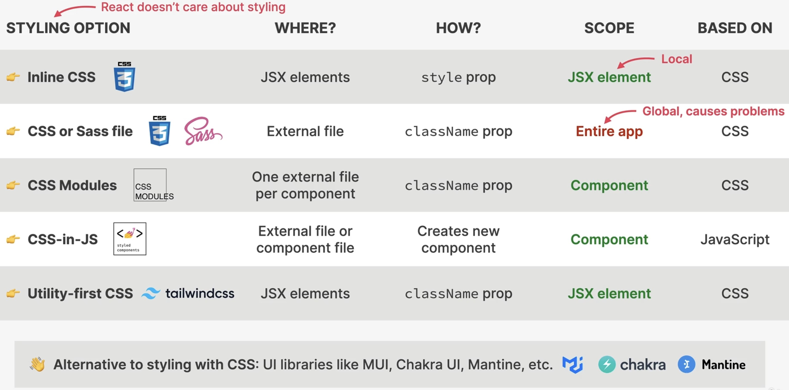

Styling Options for React Applications
======================================
Up until now, we used a single, global CSS file to style all components. In real world
applications, this is almost never the case.

Though there are multiple options to style a React applications (React doesn't care
how you style).

    Styling Options in React

* external styling libraries without CSS are not ideal for beginners
* the CSS-in-JS approach is ideal for including styling within the component
  definition itself
* CSS modules allow for a dedicated CSS file per component

.. _tutorial_react_ultimate_use_css_modules:

Using CSS modules
=================
No additional installation needed.

#. Create a ``<ComponentFileName>.module.css`` file next to the ``<ComponentFileName>.jsx`` file
   and add some styling, for example:

    .. code-block:: css

        nav {
          background-color: red;
        }

        .nav ul {
          display: flex;
          justify-content: space-between;
          list-style: none;
        }

    .. hint::

        A CSS module file **only allows classnames as root CSS element**, no element types.

#. Inside ``<ComponentFileName>.jsx`` import the style module as a name (usually ``styles``).
   Note, as the styles are imported as an object, we must access the classes via dot operator
   inside JavaScript-Mode:

    .. code-block:: jsx
        :emphasize-lines: 2,6

        import { NavLink } from "react-router-dom";
        import styles from "./PageNav.module.css";

        function PageNav() {
          return (
            <nav className={styles.nav}>
              <ul>
                <li>
                  <NavLink to="/">Home</NavLink>
                </li>
                <li>
                  <NavLink to="/pricing">Pricing</NavLink>
                </li>
                <li>
                  <NavLink to="/product">Product</NavLink>
                </li>
              </ul>
            </nav>
          );
        }

    .. note::

        Classname of CSS classes are automatically attached with a random id (e.g.
        ``_nav_3o9kt_5``), which enables us to define a different style for a similar
        element in another CSS module, without those two styles colliding.

        For example, having two ``<nav>`` elements on the same page, each with
        styles defined in their own CSS module file is working fine.

        Importing the component style as the ``styles`` object instead of using the
        classname directly (e.g. ``nav``) is necessary to utilize component CSS module's
        styles, as only then the resulting classname can be matched with the actual
        computed name (e.g. ``_nav_3o9kt_5``).

    .. important::

        When defining a global CSS file without classnames, it overwrites the styles
        of your CSS modules.

In order to define a **global style within a CSS module file**, we can use the
``:global`` syntax like this (here ``.test``)

.. code-block:: css

    :global(.test) {
      background-color: red;
    }

and then access the style from any important JSX file like this

.. code-block:: jsx
    :emphasize-lines: 6

    function Homepage() {
      return (
        

          <PageNav />
          <AppNav />
          <h1 className="test">WorldWise</h1>
          <Link to="/app">Go to app</Link>
        

      );
    }

The reason this works is that the class name **does not receive** the random id,
hence can be accessed by its name from anywhere.

.. important::

    Defining global styles within a CSS module is usually not a good idea and
    should not happen, as the style should be limited to the respective component.

This helps us in defining a style for the ``className="active"`` Nav-Element, which
it receives when it is selected.

This won't work

.. code-block:: css

    .nav .active {
      background-color: green;
    }

as the resulting classname would be something like ``_active_abcdef_1``, not simply
``active``. To prevent that, we again use the ``:global`` syntax (for ``active`` only):

.. code-block:: css

    .nav :global(.active) {
      background-color: green;
    }

.. hint::

    Global styles should only be defined inside a component's CSS class file, if
    the classname is provided by an external source, like for the active navigation
    element.