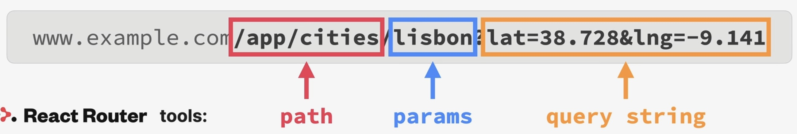

Storing state in the URL
========================
* The URL is an excellent place to store UI state and an alternative to ``useState``
  in some situations
* Examples: open/close panels, currently selected item, list sorting order, applied filter lists

* easy to way to store state in a **global place**, accessible to **all components** in the app
* good way to **"pass" data** from one page into the next page
* makes it possible to **bookmark and share** the page with the exact UI state it had at the time

    URL state stored as *params* and *query string*

Using params
------------
First, we define a Route using the city's id as **params**:

.. code-block:: jsx
    :emphasize-lines: 17

    function App() {
      {*/ other stuff */}

      return (
        {*/ other stuff */}
          <Routes>
            <Route index element={<Homepage />} />
            <Route path="product" element={<Product />} />
            <Route path="pricing" element={<Pricing />} />
            <Route path="login" element={<Login />} />
            <Route path="*" element={<PageNotFound />} />
            <Route path="app" element={<AppLayout />}>
              <Route
                index
                element={<CityList cities={cities} isLoading={isLoading} />}
              />
              <Route path="cities/:id" element={<City />} />
              <Route
                path="cities"
                element={<CityList cities={cities} isLoading={isLoading} />}
              />
              <Route
                path="countries"
                element={<CountryList cities={cities} isLoading={isLoading} />}
              />
              <Route path="form" element={
Form
} />
            </Route>
          </Routes>
      );
    }

which defines a route to ``/cities/<some_id>`` to return a City element. Any part of
the URL starting with ``:`` will be a dynamic segment.

Next, we make each ``CityItem`` to return a ``Link`` to the new URL:

.. code-block::
    :emphasize-lines: 5,10

    function CityItem({ city }) {
      const { cityName, emoji, date, id } = city;
      return (
        <li>
          <Link className={styles.cityItem} to={`${id}`}>
            {emoji}
            <h3 className={styles.name}>{cityName}</h3>
            <time className={styles.date}>{formatDate(date)}</time>
            <button className={styles.deleteBtn}>&times;</button>
          </Link>
        </li>
      );
    }

Inside the ``<City>`` component, we can access the passed parameters using the
``useParams`` hook (provided by react-router-dom):

.. code-block:: jsx
    :emphasize-lines: 2

    function City() {
      const { id } = useParams();

      {/* other stuff */}

      return <h1>City {id}</h1>;
    }

We can destructure the ``id`` and use it inside the component.

Using query strings
-------------------
Same as the params, it is added to the URL:

.. code-block:: jsx
    :emphasize-lines: 8

    function CityItem({ city }) {
      const { cityName, emoji, date, id, position } = city;
      console.log(position);
      return (
        <li>
          <Link
            className={styles.cityItem}
            to={`${id}?lat=${position.lat}&lng=${position.lng}`}
          >
            {emoji}
            <h3 className={styles.name}>{cityName}</h3>
            <time className={styles.date}>{formatDate(date)}</time>
            <button className={styles.deleteBtn}>&times;</button>
          </Link>
        </li>
      );
    }

We will access the ``lat`` and ``lng`` value inside the ``<Map>`` component using
the ``useSearchParams()`` hook. To get the query string value, we must call the
``get()`` method:

.. code-block:: jsx
    :emphasize-lines: 1,5-7,13

    import { useSearchParams } from "react-router-dom";
    import styles from "./Map.module.css";

    function Map() {
      const [searchParams, setSearchParams] = useSearchParams();
      const lat = searchParams.get("lat");
      const lng = searchParams.get("lng");

      return (
        

          <h1>Map</h1>
          <h1>
            Position: {lat}, {lng}
          </h1>
        

      );
    }

The data can also be used by any other component, which is rendered at this URL,
here inside the ``<City>`` component:

.. code-block:: jsx
    :emphasize-lines: 3-5,13

    function City() {
      const { id } = useParams();
      const [searchParams, setSearchParams] = useSearchParams();
      const lat = searchParams.get("lat");
      const lng = searchParams.get("lng");

      {/* more stuff */}

      return (
        <>
          <h1>City {id}</h1>
          

            Position {lat}, {lng}
          

        </>
      );

We can use the hook's ``setSearchParams()`` function to change the query string
values for the application:

.. code-block:: jsx
    :emphasize-lines: 13-15

    function Map() {
      const [searchParams, setSearchParams] = useSearchParams();
      const lat = searchParams.get("lat");
      const lng = searchParams.get("lng");

      return (
        

          <h1>Map</h1>
          <h1>
            Position: {lat}, {lng}
          </h1>
          <button
            onClick={() => {
              setSearchParams({ lat: 23, lng: 50 });
            }}
          >
            Set Position
          </button>
        

      );
    }