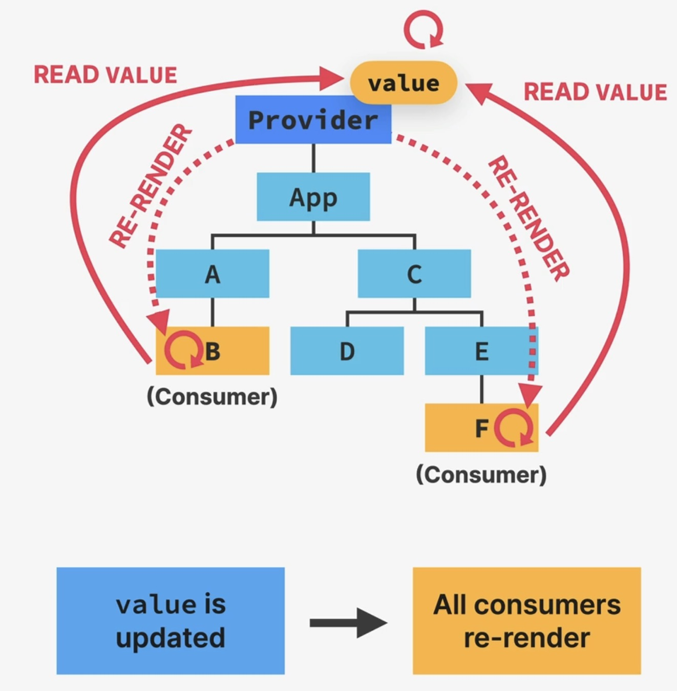

What is the Context API?
========================
:Problem:

    * Solution for prop drilling (passing down props into nested components)

        - finding a better component structure to limit prop drilling isn't always possible
        - using :ref:`component composition <tutorial_react_ultimate_component_composition>`
          to simplify prop drilling cannot always solve this problem

    * A way to **directly** pass a prop from a common parent component to deeply nested
      child components

:Solution:
    The Context API

* system to pass data throughout the app **without manually passing props**
  down the tree
* allows us to **"broadcast" global state** to the entire app (to child components
  of a certain context)

The Context API consists of:

#. a **Provider**, which gives all child components access to ``value``
   (the Provider usually sits at the very top level)
#. the ``value`` is the data that we want to make available (usually state and
   functions)
#. the **Consumers**, which are all components that read the provided context ``value``
   (we can create as many Consumer for a context as we want)

If ``value`` is updated, **all Consumer** components are automatically re-rendered.

    The Context API
