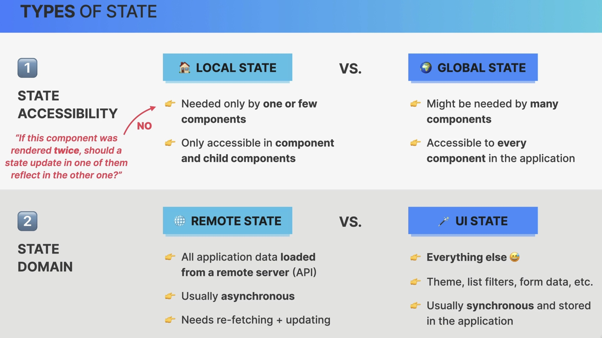
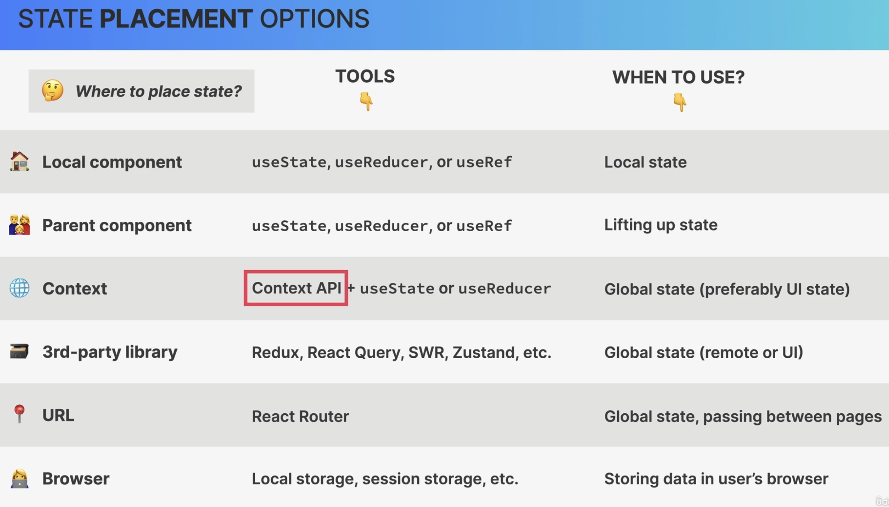
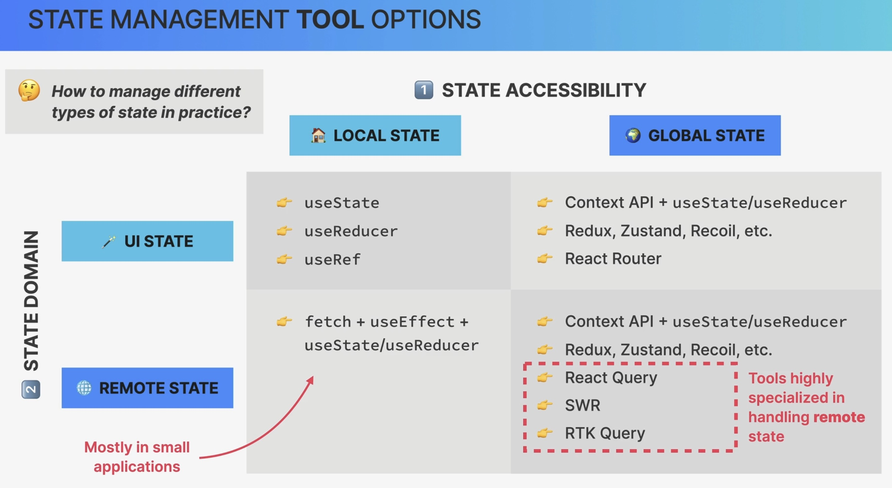

Thinking in React: Advanced State Management
============================================
So far, **state management** was about giving each piece of state the right **home**:

* **When** to use state
* **Types** of state (**accessibility**): local vs. global

In this chapter, the following topic are discussed:

* **Types** of state (**domain**): UI vs. remote
* **Where** to place each piece of state
* **Tools** to manage all types of state

The :ref:`when and where <tutorial_react_ultimate_state_management_fundamentals_when_and_where>`
to use state still apply.

Types of state
--------------
State types are categorized in terms of **accessibility**and its **domain**:

    Types of state

* Remote state is commonly loaded via an API call, therefor is usually fetched
  asynchronously and might be re-fetched and updated frequently (as something changes
  in the backed)
* Remote state and UI state are managed totally different
* Remote state requires specialized tools to manage
* UI state is commonly synchronous, without API calls and stored inside the React
  application (e.g. using ``useState`` or ``useReducer``)

State placement options
-----------------------
Altogether there are **six options**:

State management tools options
------------------------------

* In larger applications *remote local* state is handled globally, so it is treated
  the same as *remote global* state
* specialized tools on *remote global* state handle the asynchronous nature of the
  state and keep the state in-sync with the remote data